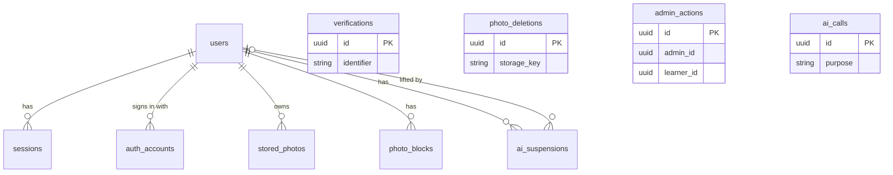
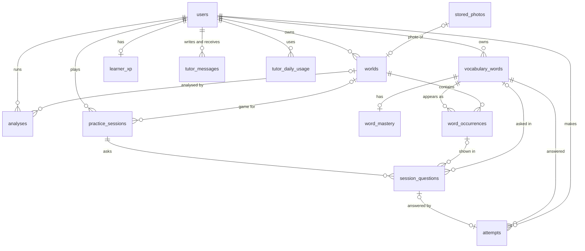

# LanguZe — Data Model (ERD and Data Dictionary)

- **Document status:** Draft v0.1 — questions raised while writing, and their decisions, are in [Appendix A](#appendix-a-questions-raised-while-writing-the-data-model)
- **Date:** 2026-09-19
- **Release covered:** Release 1.0
- **Source:** [SRS](../requirements/SRS.md) v0.10, [process flows](../flows/README.md), [architecture overview](overview.md)
- **Next documents:** API design → Prisma schema and first migration

## 1. Purpose

This document defines the database for Release 1.0: every table, its columns, keys, and constraints, which module owns it, and what happens to it when a learner, world, or word is deleted. The Prisma schema in `apps/api/prisma` implements it and becomes the source of truth once it exists; after that, this document is updated with each schema change.

## 2. Conventions

- **Names:** Prisma models are singular PascalCase (`World`); tables are plural snake_case (`worlds`) through `@@map`; columns are snake_case through `@map`.
- **IDs:** every primary key is a UUID version 7 (`@db.Uuid`, `@default(uuid(7))`), which is time-ordered for index locality and not guessable like a counter. Better Auth is configured to leave ID generation to Prisma (D5).
- **Time:** timestamps are `timestamptz` in UTC (`created_at`, `updated_at`). Where a rule depends on a calendar day in `Asia/Bangkok` (V1), the day is stored as a `date`.
- **Enums:** PostgreSQL enums through Prisma enums (section 6).
- **Lengths:** bounded text uses `varchar(n)` with the limit from the SRS, or from V19 where the SRS sets none (D2). The API validates the same limits.
- **Deletion:** learner-owned rows reference `users` with `ON DELETE CASCADE`, so deleting an account removes all its data (FR-007). Where history must survive the deletion of a parent, the reference is `ON DELETE SET NULL`. Audit entries and photo cleanup records have no foreign key, so they outlive the account.
- **Beyond Prisma:** check constraints, partial unique indexes, and the audit trigger are written as SQL in the migrations, and listed in this document.

## 3. Entity-relationship diagrams

### 3.1 Accounts, storage, moderation, and AI records

`verifications`, `photo_deletions`, `admin_actions`, and `ai_calls` have no foreign keys by design: verification rows are found by their identifier, and the other three must outlive the accounts they mention or contain no personal data.

### 3.2 Worlds, vocabulary, learning, and the tutor

## 4. Data dictionary

Types are PostgreSQL types. "Null" means the column may be empty. Every table also has the indexes implied by its primary key and unique constraints.

### 4.1 `auth` module

The four Better Auth tables keep Better Auth's model and field names in Prisma (`User`, `Session`, `Account`, `Verification`), mapped to the table names below. Better Auth's `Account` model is called `auth_accounts` in the database so it is not confused with a learner's account.

**`users`:** one row per account, learner or admin (SRS 1.3).

| Column              | Type            | Null | Notes                                                                                      |
| ------------------- | --------------- | ---- | ------------------------------------------------------------------------------------------ |
| `id`                | uuid            | no   | Primary key; also the account ID shown to learners (FR-108).                               |
| `name`              | varchar(50)     | no   | Display name, 1–50 characters (V12, V19).                                                  |
| `birth_year`        | smallint        | yes  | Year of birth given at sign-up (FR-090, V20). Empty only for a pending provider sign-up.   |
| `email`             | varchar(254)    | no   | Unique. A placeholder ending in `.invalid` for accounts without an email address (D1).     |
| `email_verified`    | boolean         | no   | Default `false`. Set by email verification or a verified provider email (FR-004, FR-009).  |
| `image`             | text            | yes  | Better Auth field; left empty, since LanguZe shows no profile pictures.                    |
| `role`              | `UserRole`      | no   | Default `LEARNER`. Changed only by the promotion script (FR-101).                          |
| `status`            | `AccountStatus` | no   | Default `ACTIVE`. `SUSPENDED` blocks sign-in (FR-105).                                     |
| `terms_accepted_at` | timestamptz     | yes  | Empty only for a pending provider sign-up, which is removed after 15 minutes (FR-090, U5). |
| `created_at`        | timestamptz     | no   | Account age for the moderation record (FR-104).                                            |
| `updated_at`        | timestamptz     | no   |                                                                                            |

Verified for AI features (SRS 1.3) is not stored: it is `email_verified`, or at least one `auth_accounts` row for Google, LINE, or Facebook (V13, V14).

**`sessions`:** Better Auth sessions (section 3 of the [authentication flow](../flows/authentication.md#3-authorizing-every-request)).

| Column       | Type        | Null | Notes                                    |
| ------------ | ----------- | ---- | ---------------------------------------- |
| `id`         | uuid        | no   | Primary key.                             |
| `user_id`    | uuid        | no   | → `users`, cascade. Indexed.             |
| `token`      | text        | no   | Unique. The session cookie's value.      |
| `expires_at` | timestamptz | no   |                                          |
| `ip_address` | text        | yes  | Kept by Better Auth for security review. |
| `user_agent` | text        | yes  | Kept by Better Auth for security review. |
| `created_at` | timestamptz | no   |                                          |
| `updated_at` | timestamptz | no   |                                          |

**`auth_accounts`:** Better Auth's link between an account and a sign-in method: the email password, or a Google, LINE, or Facebook identity.

| Column                     | Type        | Null | Notes                                                                                    |
| -------------------------- | ----------- | ---- | ---------------------------------------------------------------------------------------- |
| `id`                       | uuid        | no   | Primary key.                                                                             |
| `user_id`                  | uuid        | no   | → `users`, cascade. Indexed.                                                             |
| `provider_id`              | text        | no   | `credential`, `google`, `line`, or `facebook`.                                           |
| `account_id`               | text        | no   | The provider's user ID; for `credential`, the user's ID. Unique with `provider_id`.      |
| `password`                 | text        | yes  | Password hash, for `credential` only. Removed when an unverified account is linked (U6). |
| `access_token`             | text        | yes  | Kept empty (D3).                                                                         |
| `refresh_token`            | text        | yes  | Kept empty (D3).                                                                         |
| `id_token`                 | text        | yes  | Kept empty (D3).                                                                         |
| `access_token_expires_at`  | timestamptz | yes  | Kept empty (D3).                                                                         |
| `refresh_token_expires_at` | timestamptz | yes  | Kept empty (D3).                                                                         |
| `scope`                    | text        | yes  |                                                                                          |
| `created_at`               | timestamptz | no   |                                                                                          |
| `updated_at`               | timestamptz | no   |                                                                                          |

**`verifications`:** Better Auth's single-use tokens for email verification and password reset (FR-004, FR-005).

| Column       | Type        | Null | Notes                                                     |
| ------------ | ----------- | ---- | --------------------------------------------------------- |
| `id`         | uuid        | no   | Primary key.                                              |
| `identifier` | text        | no   | What the token is for, such as an email address. Indexed. |
| `value`      | text        | no   | The token value.                                          |
| `expires_at` | timestamptz | no   | Expired rows are removed by a scheduled task.             |
| `created_at` | timestamptz | no   |                                                           |
| `updated_at` | timestamptz | no   |                                                           |

Account deletion also removes the `verifications` rows for the account's email address in the same transaction.

### 4.2 `storage` module

**`stored_photos`:** every photo file LanguZe keeps in photo storage (FR-017).

| Column         | Type         | Null | Notes                                                  |
| -------------- | ------------ | ---- | ------------------------------------------------------ |
| `id`           | uuid         | no   | Primary key.                                           |
| `owner_id`     | uuid         | no   | → `users`, cascade. Indexed.                           |
| `storage_key`  | varchar(200) | no   | Unique. Random key of the object in photo storage.     |
| `kind`         | `PhotoKind`  | no   | `PREPARED` (at most 2,048 pixels, V18) or `THUMBNAIL`. |
| `content_type` | varchar(50)  | no   | Image type of the stored file.                         |
| `width`        | integer      | no   | Pixels.                                                |
| `height`       | integer      | no   | Pixels.                                                |
| `byte_size`    | integer      | no   |                                                        |
| `created_at`   | timestamptz  | no   |                                                        |

**`photo_deletions`:** cleanup records for photos to delete from photo storage (NFR-009). Written in the same transaction as the deletion that causes them; a scheduled task deletes the object and then the row.

| Column            | Type                  | Null | Notes                                                        |
| ----------------- | --------------------- | ---- | ------------------------------------------------------------ |
| `id`              | uuid                  | no   | Primary key.                                                 |
| `storage_key`     | varchar(200)          | no   | The object to delete. No foreign key: the owner may be gone. |
| `reason`          | `PhotoDeletionReason` | no   | Why the photo is deleted.                                    |
| `requested_at`    | timestamptz           | no   | Must be done within 24 hours of this time (V10).             |
| `attempts`        | integer               | no   | Default 0.                                                   |
| `next_attempt_at` | timestamptz           | no   | Indexed; the task picks rows whose time has come.            |
| `last_error`      | varchar(500)          | yes  | Error code or message from the last failed attempt.          |

### 4.3 `ai` module

**`ai_calls`:** metadata of every AI provider call, for reliability and cost reporting (AIR-007, NFR-017). Contains no learner identifier, photo, prompt, or message text.

| Column          | Type         | Null | Notes                                               |
| --------------- | ------------ | ---- | --------------------------------------------------- |
| `id`            | uuid         | no   | Primary key.                                        |
| `purpose`       | `AiPurpose`  | no   | `SAFETY_CHECK`, `EXTRACTION`, or `TUTOR`.           |
| `provider`      | varchar(50)  | no   |                                                     |
| `model`         | varchar(100) | no   |                                                     |
| `started_at`    | timestamptz  | no   | Indexed.                                            |
| `latency_ms`    | integer      | no   |                                                     |
| `input_tokens`  | integer      | yes  | When the provider reports it.                       |
| `output_tokens` | integer      | yes  | When the provider reports it.                       |
| `outcome`       | `AiOutcome`  | no   |                                                     |
| `error_code`    | varchar(100) | yes  |                                                     |
| `request_id`    | varchar(100) | yes  | Links the call to the API's request logs (NFR-016). |

### 4.4 `worlds` module

**`worlds`** (FR-010–FR-017, FR-021):

| Column           | Type              | Null | Notes                                                                         |
| ---------------- | ----------------- | ---- | ----------------------------------------------------------------------------- |
| `id`             | uuid              | no   | Primary key.                                                                  |
| `learner_id`     | uuid              | no   | → `users`, cascade.                                                           |
| `name`           | varchar(50)       | no   | 1–50 characters (V3).                                                         |
| `status`         | `WorldStatus`     | no   | `ANALYZING`, `READY`, or `FAILED`.                                            |
| `failure_reason` | `AnalysisFailure` | yes  | Set when `FAILED`; decides the message and whether retry is offered.          |
| `photo_id`       | uuid              | yes  | → `stored_photos`, set null. Empty after a blocked photo is deleted (FR-092). |
| `thumbnail_id`   | uuid              | yes  | → `stored_photos`, set null.                                                  |
| `created_at`     | timestamptz       | no   | "Most recently created world" for review questions (FR-051).                  |
| `updated_at`     | timestamptz       | no   |                                                                               |

Index: (`learner_id`, `created_at`). Word counts and mastered-word counts on the world list (FR-013) are computed by query.

**`analyses`:** one row per analysis run, used for the daily limit (FR-020, U2).

| Column           | Type              | Null | Notes                                                                         |
| ---------------- | ----------------- | ---- | ----------------------------------------------------------------------------- |
| `id`             | uuid              | no   | Primary key.                                                                  |
| `learner_id`     | uuid              | no   | → `users`, cascade.                                                           |
| `world_id`       | uuid              | yes  | → `worlds`, **set null**, so deleting a world cannot give back used analyses. |
| `status`         | `AnalysisStatus`  | no   | `IN_PROGRESS`, `SUCCEEDED`, `BLOCKED`, or `FAILED`.                           |
| `failure_reason` | `AnalysisFailure` | yes  | Set when `FAILED` or `BLOCKED`.                                               |
| `started_at`     | timestamptz       | no   |                                                                               |
| `finished_at`    | timestamptz       | yes  |                                                                               |

Indexes: (`learner_id`, `started_at`) for the daily count; (`status`, `started_at`) for the 5-minute rule (V16). The daily count is the number of the learner's analyses started since midnight `Asia/Bangkok` with status `IN_PROGRESS`, `SUCCEEDED`, or `BLOCKED`. It is checked under a transaction-scoped advisory lock for the learner, so parallel uploads cannot both take the last analysis.

### 4.5 `vocabulary` module

**`vocabulary_words`:** a learner's word, identified by its English word and Thai meaning (FR-043).

| Column             | Type         | Null | Notes                                                                                      |
| ------------------ | ------------ | ---- | ------------------------------------------------------------------------------------------ |
| `id`               | uuid         | no   | Primary key.                                                                               |
| `learner_id`       | uuid         | no   | → `users`, cascade.                                                                        |
| `english`          | varchar(40)  | no   | Normalized English word in singular base form (SRS 4.2, AIR-003); also displayed.          |
| `thai_meaning`     | varchar(100) | no   | Thai meaning as displayed (V19).                                                           |
| `thai_meaning_key` | varchar(100) | no   | The Thai meaning with surrounding spaces removed and inner spaces collapsed, for identity. |
| `created_at`       | timestamptz  | no   |                                                                                            |

Unique: (`learner_id`, `english`, `thai_meaning_key`). A word is deleted, with its mastery and attempts, when its last occurrence is removed (FR-015, FR-027).

**`word_occurrences`:** a word in one world's photo (SRS 1.3).

| Column               | Type             | Null | Notes                                                                           |
| -------------------- | ---------------- | ---- | ------------------------------------------------------------------------------- |
| `id`                 | uuid             | no   | Primary key.                                                                    |
| `world_id`           | uuid             | no   | → `worlds`, cascade.                                                            |
| `vocabulary_word_id` | uuid             | no   | → `vocabulary_words`, cascade. Indexed.                                         |
| `box_x`              | double precision | no   | Highlight box, relative to the prepared photo (0–1).                            |
| `box_y`              | double precision | no   |                                                                                 |
| `box_width`          | double precision | no   |                                                                                 |
| `box_height`         | double precision | no   |                                                                                 |
| `example_sentence`   | varchar(200)     | no   | A1–B1 English containing the word or a variant (AIR-003, AIR-005, V19).         |
| `cefr_level`         | `CefrLevel`      | no   |                                                                                 |
| `accepted_variants`  | varchar(40)[]    | no   | Normalized, unique, at most 10 (AIR-003, V19). The word itself is not repeated. |
| `created_at`         | timestamptz      | no   |                                                                                 |

Unique: (`world_id`, `vocabulary_word_id`), because duplicates within a photo are merged (AIR-004). Check constraint: the box lies inside 0–1 with a width and height above 0 (AIR-003). A `READY` world has 3–12 occurrences when its analysis finishes (FR-024), enforced by the API; the learner may later remove words down to one (FR-026).

### 4.6 `learning` module

**`word_mastery`** (FR-040, FR-041, SRS 4.1). No row means `NEW`: the row is created by the first attempt, so extraction does not write learning data.

| Column               | Type           | Null | Notes                                                                 |
| -------------------- | -------------- | ---- | --------------------------------------------------------------------- |
| `vocabulary_word_id` | uuid           | no   | Primary key; → `vocabulary_words`, cascade.                           |
| `learner_id`         | uuid           | no   | → `users`, cascade. Copied from the word for queries by learner.      |
| `level`              | `MasteryLevel` | no   | `LEARNING`, `FAMILIAR`, or `MASTERED`; `NEW` is the absence of a row. |
| `streak`             | smallint       | no   | Correct-answer streak (SRS 4.1).                                      |
| `familiar_on`        | date           | yes  | The `Asia/Bangkok` day the word last became `FAMILIAR`.               |
| `last_practised_at`  | timestamptz    | no   | For "least recently practised first" (FR-050).                        |
| `updated_at`         | timestamptz    | no   |                                                                       |

Index: (`learner_id`, `level`). Check constraint: the streak is not negative.

**`practice_sessions`:** game and review sessions (FR-030, FR-036, FR-050).

| Column         | Type            | Null | Notes                                                                     |
| -------------- | --------------- | ---- | ------------------------------------------------------------------------- |
| `id`           | uuid            | no   | Primary key.                                                              |
| `learner_id`   | uuid            | no   | → `users`, cascade.                                                       |
| `kind`         | `SessionKind`   | no   | `GAME` or `REVIEW`.                                                       |
| `world_id`     | uuid            | yes  | → `worlds`, set null. Set for games only.                                 |
| `status`       | `SessionStatus` | no   | `IN_PROGRESS`, `COMPLETED`, or `ABANDONED`.                               |
| `started_at`   | timestamptz     | no   | An `IN_PROGRESS` session older than 24 hours counts as `ABANDONED` (V17). |
| `completed_at` | timestamptz     | yes  |                                                                           |

Index: (`learner_id`, `started_at`). Partial unique indexes: one `IN_PROGRESS` game per learner and world, and one `IN_PROGRESS` review per learner. Starting a new session first marks the old one `ABANDONED` in the same transaction; the indexes are what keep two sessions from existing if two requests arrive together. A game whose world was deleted keeps an empty `world_id`, which the index treats as distinct, so those closed-off sessions constrain nothing.

**`session_questions`:** the ordered questions of a session, fixed when it is created.

| Column               | Type     | Null | Notes                                                                |
| -------------------- | -------- | ---- | -------------------------------------------------------------------- |
| `id`                 | uuid     | no   | Primary key.                                                         |
| `session_id`         | uuid     | no   | → `practice_sessions`, cascade.                                      |
| `position`           | smallint | no   | 1–10. Unique with `session_id`; a check keeps it at 1 or above.      |
| `vocabulary_word_id` | uuid     | yes  | → `vocabulary_words`, set null.                                      |
| `occurrence_id`      | uuid     | yes  | → `word_occurrences`, set null. When empty, the question is skipped. |

**`attempts`:** every answer (FR-034); an incorrect attempt is a mistake (FR-042).

| Column               | Type           | Null | Notes                                                                                        |
| -------------------- | -------------- | ---- | -------------------------------------------------------------------------------------------- |
| `id`                 | uuid           | no   | Primary key.                                                                                 |
| `learner_id`         | uuid           | no   | → `users`, cascade.                                                                          |
| `vocabulary_word_id` | uuid           | no   | → `vocabulary_words`, cascade, so mistakes stay while the word exists in any world (FR-015). |
| `question_id`        | uuid           | yes  | → `session_questions`, set null. **Unique**: one attempt per question (FR-034, S5).          |
| `session_id`         | uuid           | yes  | → `practice_sessions`, set null (FR-034).                                                    |
| `occurrence_id`      | uuid           | yes  | → `word_occurrences`, set null (FR-034).                                                     |
| `answer_text`        | varchar(100)   | yes  | What the learner typed; empty for "I don't know" (FR-032, V19).                              |
| `is_dont_know`       | boolean        | no   |                                                                                              |
| `is_correct`         | boolean        | no   |                                                                                              |
| `xp_awarded`         | smallint       | no   | 10 or 0 (FR-060).                                                                            |
| `level_before`       | `MasteryLevel` | yes  | Where the word stood before this answer; empty means it was `NEW`.                           |
| `level_after`        | `MasteryLevel` | no   | And where it stands after.                                                                   |
| `answered_at`        | timestamptz    | no   |                                                                                              |

The two level columns are kept because a session's summary has to name the words whose level changed (FR-035), and nothing can work that out afterwards: `word_mastery` holds only where a word stands now, which by the end of a session is where it ended rather than where it began.

Indexes: (`learner_id`, `answered_at`) for recent mistakes; (`vocabulary_word_id`, `answered_at`). Check constraints: an "I don't know" attempt has no answer text and is not correct; XP is never negative, and an incorrect attempt earns none (FR-033, V4).

**`learner_xp`:** total XP, stored so it never decreases when attempts are deleted (FR-060, V4).

| Column       | Type        | Null | Notes                                                           |
| ------------ | ----------- | ---- | --------------------------------------------------------------- |
| `learner_id` | uuid        | no   | Primary key; → `users`, cascade.                                |
| `total_xp`   | integer     | no   | Default 0. Only ever increased; a check keeps it at 0 or above. |
| `updated_at` | timestamptz | no   |                                                                 |

### 4.7 `tutor` module

**`tutor_messages`:** the learner's single conversation (FR-070, V6).

| Column       | Type        | Null | Notes                                                                   |
| ------------ | ----------- | ---- | ----------------------------------------------------------------------- |
| `id`         | uuid        | no   | Primary key.                                                            |
| `learner_id` | uuid        | no   | → `users`, cascade.                                                     |
| `role`       | `TutorRole` | no   | `LEARNER` or `TUTOR`.                                                   |
| `content`    | text        | no   | Learner messages are at most 1,000 characters (V7), checked by the API. |
| `created_at` | timestamptz | no   |                                                                         |

Index: (`learner_id`, `created_at`). Clearing the conversation deletes these rows only (FR-076).

**`tutor_daily_usage`:** messages used per learner per day (FR-071, S6).

| Column          | Type        | Null | Notes                                       |
| --------------- | ----------- | ---- | ------------------------------------------- |
| `learner_id`    | uuid        | no   | → `users`, cascade. Primary key with `day`. |
| `day`           | date        | no   | `Asia/Bangkok` day (V1).                    |
| `messages_used` | smallint    | no   | Default 0.                                  |
| `updated_at`    | timestamptz | no   |                                             |

A message is reserved with one conditional update that increments `messages_used` only while it is below the limit, and released by decrementing it if the provider fails, so no explicit lock is needed.

### 4.8 `moderation` module

**`photo_blocks`** (FR-095): never the photo itself.

| Column       | Type            | Null | Notes                                       |
| ------------ | --------------- | ---- | ------------------------------------------- |
| `id`         | uuid            | no   | Primary key.                                |
| `learner_id` | uuid            | no   | → `users`, cascade.                         |
| `category`   | `BlockCategory` | no   | The FR-091 category the safety check found. |
| `created_at` | timestamptz     | no   |                                             |

Index: (`learner_id`, `created_at`) for "3 blocked photos within 7 days" (V15).

**`ai_suspensions`** (FR-096, FR-098, V15):

| Column       | Type               | Null | Notes                                                           |
| ------------ | ------------------ | ---- | --------------------------------------------------------------- |
| `id`         | uuid               | no   | Primary key.                                                    |
| `learner_id` | uuid               | no   | → `users`, cascade.                                             |
| `reason`     | `SuspensionReason` | no   |                                                                 |
| `starts_at`  | timestamptz        | no   | Queue order, oldest first (FR-103).                             |
| `ends_at`    | timestamptz        | yes  | Empty means "until an admin reviews". Set or moved by an admin. |
| `lifted_at`  | timestamptz        | yes  | Set when an admin lifts the suspension.                         |
| `lifted_by`  | uuid               | yes  | → `users`, set null. The admin who lifted it.                   |
| `created_at` | timestamptz        | no   |                                                                 |
| `updated_at` | timestamptz        | no   |                                                                 |

Index: (`learner_id`, `starts_at`). A learner's current suspension is the latest one that is not lifted and whose end time is empty or in the future; it awaits review when its end time is empty. The review queue lists active accounts whose current suspension awaits review (FR-103, U4).

**`admin_actions`:** the audit log (FR-106).

| Column       | Type              | Null | Notes                                                                 |
| ------------ | ----------------- | ---- | --------------------------------------------------------------------- |
| `id`         | uuid              | no   | Primary key.                                                          |
| `admin_id`   | uuid              | no   | No foreign key, so the entry outlives the admin's account.            |
| `learner_id` | uuid              | no   | No foreign key, so the entry outlives the learner's account (FR-106). |
| `action`     | `AdminActionType` | no   |                                                                       |
| `reason`     | varchar(500)      | no   | 1–500 characters (FR-105, V19).                                       |
| `details`    | jsonb             | yes  | For example, the new end date of a suspension.                        |
| `created_at` | timestamptz       | no   | Indexed; the log is shown newest first.                               |

Index also on `learner_id`. A database trigger rejects every update and delete (D4).

## 5. What happens on deletion

| Deleted                   | Effect                                                                                                                                                                                                                                                                                                 |
| ------------------------- | ------------------------------------------------------------------------------------------------------------------------------------------------------------------------------------------------------------------------------------------------------------------------------------------------------ |
| Account (`users` row)     | Cascades to every learner-owned table. In the same transaction, the API writes `photo_deletions` for the learner's `stored_photos` and deletes the `verifications` for the email. `admin_actions` stay, with IDs only; `ai_suspensions.lifted_by` of other learners becomes empty.                     |
| World                     | Cascades to its `word_occurrences`. The API deletes words left without occurrences (cascading to their mastery and attempts), deletes the world's `stored_photos` rows, and writes `photo_deletions`. `analyses`, `practice_sessions`, and `session_questions` keep their rows with the links cleared. |
| Word removed from a world | The occurrence is deleted; if it was the word's last occurrence, the word is deleted too, as for a world.                                                                                                                                                                                              |
| Blocked photo             | The `stored_photos` rows are deleted and `photo_deletions` written; the world keeps its row with `photo_id` empty.                                                                                                                                                                                     |
| Tutor conversation        | Deletes `tutor_messages` only; `tutor_daily_usage` stays.                                                                                                                                                                                                                                              |

## 6. Enums

| Enum                  | Values                                                                                                                           |
| --------------------- | -------------------------------------------------------------------------------------------------------------------------------- |
| `UserRole`            | `LEARNER`, `ADMIN`                                                                                                               |
| `AccountStatus`       | `ACTIVE`, `SUSPENDED`                                                                                                            |
| `PhotoKind`           | `PREPARED`, `THUMBNAIL`                                                                                                          |
| `PhotoDeletionReason` | `WORLD_DELETED`, `ACCOUNT_DELETED`, `PHOTO_BLOCKED`, `UPLOAD_FAILED`                                                             |
| `AiPurpose`           | `SAFETY_CHECK`, `EXTRACTION`, `TUTOR`                                                                                            |
| `AiOutcome`           | `SUCCEEDED`, `FAILED`, `TIMED_OUT`, `INVALID_OUTPUT`                                                                             |
| `WorldStatus`         | `ANALYZING`, `READY`, `FAILED`                                                                                                   |
| `AnalysisStatus`      | `IN_PROGRESS`, `SUCCEEDED`, `BLOCKED`, `FAILED`                                                                                  |
| `AnalysisFailure`     | `BLOCKED`, `TOO_FEW_WORDS`, `PROVIDER_ERROR`, `INVALID_OUTPUT`, `TIMED_OUT`                                                      |
| `CefrLevel`           | `A1`, `A2`, `B1`, `B2`, `C1`, `C2`                                                                                               |
| `MasteryLevel`        | `LEARNING`, `FAMILIAR`, `MASTERED` (`NEW` is the absence of a row)                                                               |
| `SessionKind`         | `GAME`, `REVIEW`                                                                                                                 |
| `SessionStatus`       | `IN_PROGRESS`, `COMPLETED`, `ABANDONED`                                                                                          |
| `TutorRole`           | `LEARNER`, `TUTOR`                                                                                                               |
| `BlockCategory`       | `SEXUAL_CONTENT`, `SUSPECTED_ILLEGAL_MATERIAL`, `VIOLENCE`, `ILLEGAL_ACTIVITY`, `HATE_SYMBOL`, `PERSONAL_DATA`, `OTHER` (FR-091) |
| `SuspensionReason`    | `REPEATED_BLOCKS` (level 1), `REPEATED_AFTER_SUSPENSION` (level 2), `SUSPECTED_ILLEGAL_MATERIAL` (FR-098)                        |
| `AdminActionType`     | `LIFT_AI_SUSPENSION`, `SET_AI_SUSPENSION_END`, `SUSPEND_ACCOUNT`, `REACTIVATE_ACCOUNT`, `DELETE_ACCOUNT`                         |

## 7. Personal data

For the Privacy Policy and PDPA requests, this is where personal data lives and how it is removed. A learner deletes everything themselves with `DELETE /v1/me`, which removes the `users` row; every table below with a foreign key to it is removed by the cascade in the same statement.

| Data                                       | Where                                        | Removed                                                    |
| ------------------------------------------ | -------------------------------------------- | ---------------------------------------------------------- |
| Email address, display name, year of birth | `users`                                      | With the account.                                          |
| Sign-in identities at providers            | `auth_accounts.account_id`                   | With the account.                                          |
| IP address and browser of sessions         | `sessions`                                   | With the session or the account.                           |
| Photos of the learner's surroundings       | Photo storage, referenced by `stored_photos` | Within 24 hours of the world or account deletion (V10).    |
| World names, words, answers, mistakes      | `worlds`, `vocabulary_words`, `attempts`     | With the world, the word, or the account.                  |
| Tutor conversation                         | `tutor_messages`                             | When cleared, or with the account.                         |
| Moderation history                         | `photo_blocks`, `ai_suspensions`             | With the account (U8).                                     |
| Account identifiers in the audit log       | `admin_actions`                              | Kept by design (FR-106); IDs only, no other personal data. |

`ai_calls` and `photo_deletions` contain no personal data.

## Appendix A. Questions raised while writing the data model

| ID  | Question                                                                                                                            | Decision                                                                                                                                                                                                                                                                                                                                                                                                                                                                                                    | Affects                                   | Status               |
| --- | ----------------------------------------------------------------------------------------------------------------------------------- | ----------------------------------------------------------------------------------------------------------------------------------------------------------------------------------------------------------------------------------------------------------------------------------------------------------------------------------------------------------------------------------------------------------------------------------------------------------------------------------------------------------- | ----------------------------------------- | -------------------- |
| D1  | Better Auth requires an email address on every account, but LINE and Facebook accounts may have none (FR-009). How are they stored? | Follow Better Auth's documented approach: give such accounts a placeholder address built from the provider and the provider's user ID, on the reserved `.invalid` domain, for example `line.U1234@no-email.languze.invalid`. The `.invalid` domain can never receive mail. The API treats any address ending in `.invalid` as "no email address": it never sends email to it, offers no password reset, never shows it to the learner, and admin search finds such learners by account ID instead (FR-108). | `users.email`; auth configuration; FR-009 | Confirmed 2026-09-19 |
| D2  | The SRS sets no length for some stored text. What limits apply?                                                                     | Display name 1–50 characters; Thai meaning 1–100; example sentence up to 200; at most 10 accepted variants per word, each up to 40 like the word itself; typed answer up to 100; admin reason 1–500. Recorded in SRS v0.9 as V19.                                                                                                                                                                                                                                                                           | Column types; API validation; SRS         | Confirmed 2026-09-19 |
| D3  | Better Auth can store the access, refresh, and ID tokens returned by Google, LINE, and Facebook. Should LanguZe keep them?          | No. LanguZe never calls those providers after sign-in, so a stolen database would hand an attacker working tokens for nothing. A Better Auth database hook clears the token fields before they are saved. If that proves impractical, Better Auth's `encryptOAuthTokens` option encrypts them instead.                                                                                                                                                                                                      | `auth_accounts`; Better Auth ADR          | Confirmed 2026-09-19 |
| D4  | FR-106 forbids editing or deleting audit entries through the application. Should the database enforce it too?                       | Yes. A trigger on `admin_actions` rejects every update and delete, so not even a bug or a manual query can change the audit log. Inserts still work, and the trigger is part of the migration.                                                                                                                                                                                                                                                                                                              | `admin_actions`; migration                | Confirmed 2026-09-19 |
| D5  | Which kind of primary key?                                                                                                          | UUID version 7 for every table, generated by Prisma, with Better Auth configured to leave ID generation to Prisma. Version 7 UUIDs are ordered by time, which keeps indexes compact, and unlike counters they reveal nothing about how many accounts or worlds exist.                                                                                                                                                                                                                                       | All tables                                | Confirmed 2026-09-19 |
