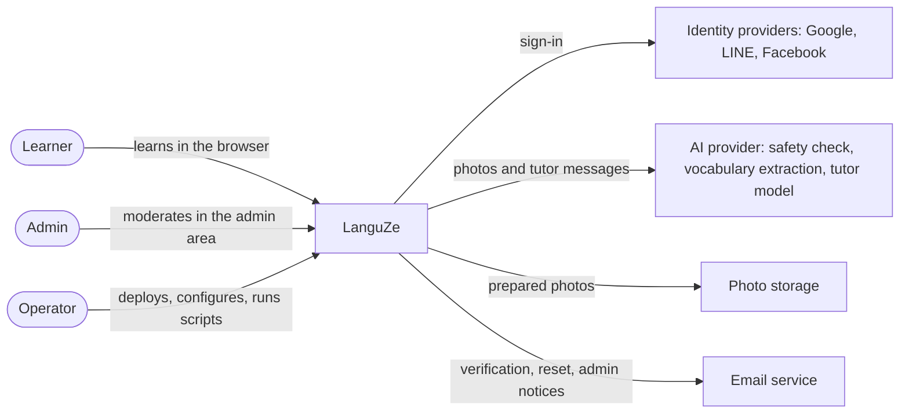
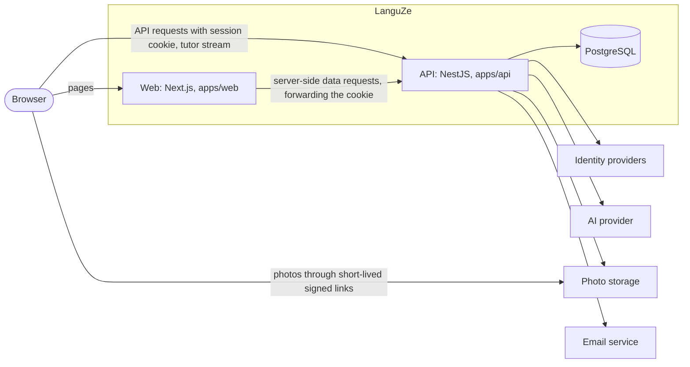
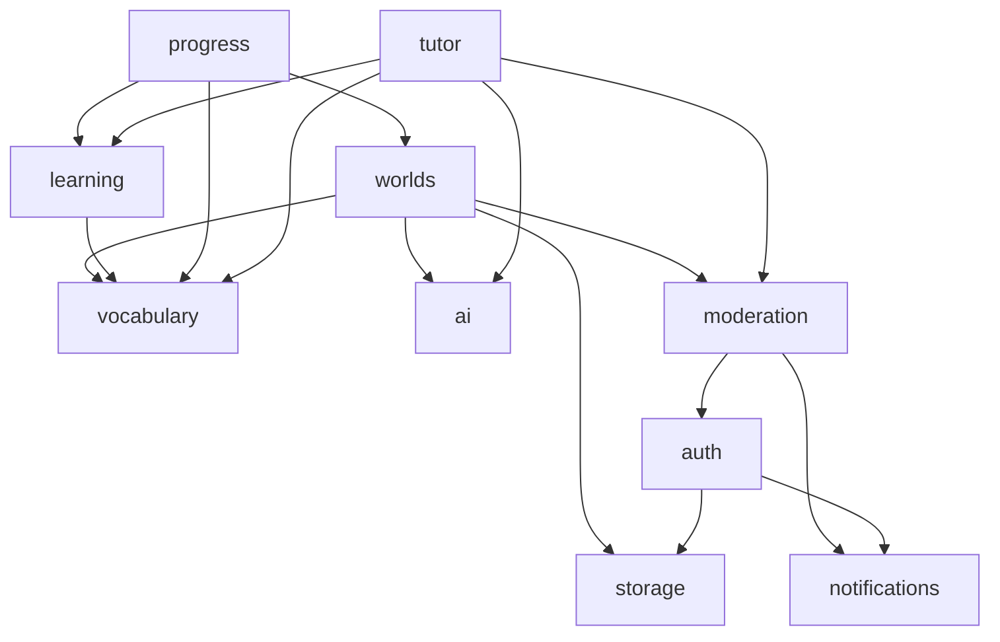
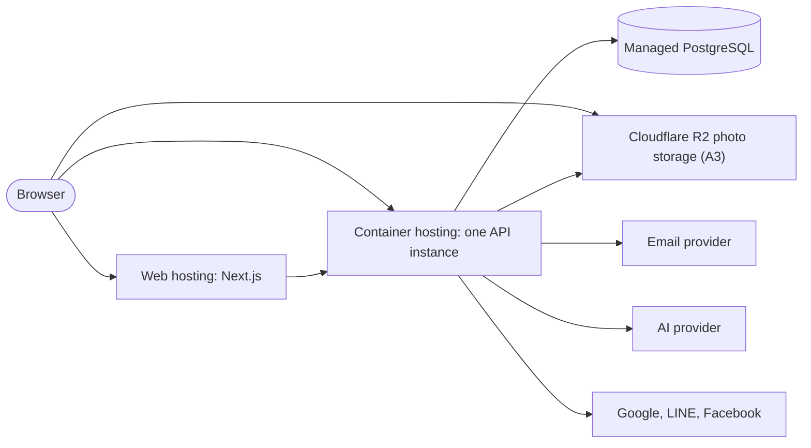

# LanguZe — Architecture Overview

- **Document status:** Draft v0.1 — questions raised while writing, and their decisions, are in [Appendix A](#appendix-a-questions-raised-while-writing-the-overview)
- **Date:** 2026-09-19
- **Release covered:** Release 1.0
- **Source:** [SRS](../requirements/SRS.md) v0.8, [process flows](../flows/README.md), [ADR-0001](adr/0001-modular-monolith.md), [ADR-0002](adr/0002-toolchain-baseline.md)
- **Next documents:** API design → Prisma schema and first migration

## 1. Purpose

This document describes how LanguZe Release 1.0 is built: the systems it talks to, the applications it consists of, the modules inside the API, and the rules that keep them consistent. It records the architecture decisions taken while writing the process flows (P1–P4, P6) and says where each larger decision gets its own ADR.

It does not define tables, endpoints, or hosting providers; those belong to the ERD, the API design, and the deployment document.

## 2. Guiding principles

- **Modular monolith** ([ADR-0001](adr/0001-modular-monolith.md)): one web application, one API, one database. Modules have explicit boundaries and no circular dependencies.
- **The API owns all data and integrations:** only the API talks to the database, photo storage, the email service, identity providers, and AI providers (SRS 2.1).
- **Add infrastructure only for a documented need:** no Redis, queue, message broker, or WebSocket server in Release 1.0 (section 8 says when each would be added).
- **Replaceable providers:** AI, photo storage, and email are reached through interfaces owned by LanguZe, so a provider can change without touching business rules (AIR-001).
- **Cost:** about USD 10 per month at launch (NFR-017); free tiers where they are enough.

## 3. System context

Who and what LanguZe interacts with:

## 4. Applications and services

| Part          | Responsibility                                                                                                                                                                                                                                   |
| ------------- | ------------------------------------------------------------------------------------------------------------------------------------------------------------------------------------------------------------------------------------------------ |
| Web           | Renders pages. Server Components fetch initial data from the API; client components call the API directly for interaction (answers, polling, the tutor stream). Holds no secrets and no business rules beyond input checks for usability.        |
| API           | All business rules, authorization, and integrations. Runs Better Auth (P1), background photo analysis (P2), and scheduled tasks. Exposes a REST API documented with OpenAPI (Swagger, already in place), plus one server-sent event stream (P6). |
| PostgreSQL    | The only database. Prisma schema and migrations in `apps/api` are its source of truth. pgvector is available but not enabled until RAG needs it.                                                                                                 |
| Photo storage | Private object storage for prepared photos (FR-017). Browsers get photos only through short-lived signed links issued by the API (P4). Cloudflare R2 in production, SeaweedFS in docker-compose locally (A3).                                    |

**How the web app reaches the API (A1):** in production, the web app and the API are served from subdomains of one LanguZe domain, and the API's session cookie is set for that domain. The browser calls the API directly with the cookie, and the Next.js server forwards the cookie when it fetches data. The session cookie is `HttpOnly`, `Secure`, and `SameSite=Lax`, and the API only accepts cross-origin requests from the web app's origin. Locally, `localhost:3003` and `localhost:4001` already count as the same site.

## 5. API modules

Each module is a NestJS module that owns its data and exposes services to other modules. A module writes only its own data; other modules go through its services.

| Module          | Owns                                                                                                       | Responsibilities                                                                                                                                                   |
| --------------- | ---------------------------------------------------------------------------------------------------------- | ------------------------------------------------------------------------------------------------------------------------------------------------------------------ |
| `platform`      | —                                                                                                          | Configuration, Prisma client, health check, logging with request IDs, the `Asia/Bangkok` day helper, scheduled tasks.                                              |
| `auth`          | Accounts (role, status, verification, Terms acceptance, display name), sessions, provider sign-ins, tokens | Better Auth (P1): sign-up, sign-in, linking, password reset, sessions; guards for session, role, and verification; account deletion.                               |
| `storage`       | Stored photos, cleanup records                                                                             | Photo storage interface and adapter, signed links, deletion with retries (NFR-009).                                                                                |
| `ai`            | AI call records                                                                                            | AI interface (safety check, vocabulary extraction, tutor chat with tools) and provider adapters; schema validation of AI output; call metadata (AIR-001, AIR-007). |
| `notifications` | —                                                                                                          | Email interface and adapter; verification, reset, and admin notification emails.                                                                                   |
| `vocabulary`    | Vocabulary words, occurrences                                                                              | Word identity and normalization (FR-043), item rules and post-processing of extracted words (AIR-003, AIR-004).                                                    |
| `worlds`        | Worlds, analyses                                                                                           | World management, photo preparation (FR-017), background analysis (P2), the 5-minute rule (V16), the daily analysis limit.                                         |
| `learning`      | Sessions, questions, attempts, mastery, total XP                                                           | Game and review sessions, answer checking (SRS 4.2), mastery rules (SRS 4.1), XP (FR-060).                                                                         |
| `progress`      | —                                                                                                          | Read-only progress views built from `learning`, `vocabulary`, and `worlds` (FR-061).                                                                               |
| `tutor`         | Conversation, messages, daily message usage                                                                | Tutor chat, read-only tools, streaming (P6), the daily message limit.                                                                                              |
| `moderation`    | Block records, AI suspensions, audit entries                                                               | Suspension rules (V15, FR-098), AI access check, review queue, learner search, admin actions (FR-100–FR-108).                                                      |

Dependencies between modules (an arrow means "calls"):

- Every module also uses `platform`, and every controller uses the guards from `auth`; those links are left out of the diagram.
- **Account deletion** removes the account row; every learner-owned table references it with a cascading delete, so `auth` does not need to know every module. Audit entries keep the learner identifier without a foreign key (FR-106). `auth` asks `storage` to schedule the learner's photos for deletion in the same transaction.
- **Mastery belongs to `learning`,** not `vocabulary`, so photo-independent word sources, such as the exam vocabulary tracks on the roadmap, can reuse it (SRS 2.4).
- **Limits live with the data they count:** `worlds` counts analyses and `tutor` counts messages, both with the day helper from `platform`.

### 5.1 AI interface

Business logic depends on three LanguZe-owned interfaces in the `ai` module, never on a provider SDK (AIR-001):

| Interface            | Input                                    | Output                                                             |
| -------------------- | ---------------------------------------- | ------------------------------------------------------------------ |
| Safety check         | A prepared photo                         | Pass, or blocked with a category (FR-091, FR-092)                  |
| Vocabulary extractor | A prepared photo                         | Items matching the extraction output schema, before the item rules |
| Tutor model          | Instructions, messages, tool definitions | A stream of text and tool requests                                 |

Each provider has an adapter implementing these interfaces. Unit tests use fakes; evaluation cases run separately against real providers (AIR-008). The first provider, Google Gemini, and how its models are chosen are recorded in [ADR-0004](adr/0004-ai-provider.md).

## 6. Cross-cutting rules

- **Transactions across modules:** when one change spans modules, as with an attempt, its mastery update, and XP, or a blocked photo and its suspension check, the calling service opens the transaction and passes the transaction client to the other modules' services.
- **Side effects after commit:** emails and photo deletions run only after the transaction commits ([flow rules](../flows/README.md#rules-for-every-flow)). Photo deletions are recorded as cleanup records inside the transaction and retried by a scheduled task.
- **Authorization:** guards check the session, role, and verification for every request, reading account status and role from the database each time (NFR-019). Services receive the learner from the session, never from request input (FR-008).
- **Validation:** request DTOs are validated with class-validator at the API boundary (already configured). The web app validates forms with React Hook Form and Zod for usability only; the API always decides.
- **Rate limits:** per learner and per IP address for the endpoints in NFR-005 and for admin actions (NFR-019), kept in the API's memory (A2).
- **Time:** timestamps are stored in UTC; days and daily limits use `Asia/Bangkok` (V1).
- **Logging:** structured logs with a request ID on every line. Passwords, tokens, photos, prompts, and tutor text are never logged (NFR-008, NFR-016).
- **Configuration:** environment variables validated at startup (already in place), including the usage limits (FR-081).

## 7. Deployment view

Release 1.0 runs one instance of each application (A2):

- **One API instance** keeps background analysis, scheduled tasks, and rate limits in one process, with no Redis or queue. Scaling out later needs shared rate limits, a job queue, and a single runner for scheduled tasks (section 8).
- **Local development** uses Docker Compose for PostgreSQL and Maildev, plus SeaweedFS as local S3-compatible storage, added together with the `storage` module (A3). The applications run on the host with `pnpm dev` ([local development](../deployment/local-development.md)).
- Hosting providers, the email provider, domains, and environment variables are chosen in [production deployment](../deployment/production.md): both applications on Railway in Singapore, Neon for PostgreSQL, Resend for email, all under `languze.com` with the API on `api.languze.com`.

## 8. How the architecture grows

| Need                                               | Added then                                                  | Roadmap item                |
| -------------------------------------------------- | ----------------------------------------------------------- | --------------------------- |
| More than one API instance, or heavy analysis load | Redis for rate limits, a job queue for analyses and cleanup | Growth beyond Release 1.0   |
| Real-time multiplayer and live leaderboards        | Socket.IO, with Redis for shared state                      | Multiplayer challenges      |
| Several consumers of the same learning events      | A message broker, starting with in-process domain events    | Achievements, notifications |
| Tutor grounded in full learning history            | pgvector in the existing PostgreSQL                         | RAG tutor                   |
| A module that needs its own scaling or ownership   | Extraction into a service, with its own ADR (ADR-0001)      | Only when justified         |

## 9. Decisions and where they are recorded

| Decision                                             | Status             | Recorded in                                                 |
| ---------------------------------------------------- | ------------------ | ----------------------------------------------------------- |
| Modular monolith                                     | Accepted           | [ADR-0001](adr/0001-modular-monolith.md)                    |
| Toolchain and version pins                           | Accepted           | [ADR-0002](adr/0002-toolchain-baseline.md)                  |
| Better Auth inside the API (P1)                      | Accepted           | [ADR-0003](adr/0003-better-auth-in-api.md)                  |
| AI interface and Google Gemini as the first provider | Accepted           | Section 5.1; [ADR-0004](adr/0004-ai-provider.md)            |
| PostgreSQL as the only database, pgvector later      | Accepted           | [ADR-0005](adr/0005-postgresql-and-pgvector.md)             |
| Background analysis in the API process (P2)          | Decided 2026-09-19 | This document, sections 4 and 7                             |
| Status polling every 3 seconds (P3)                  | Decided 2026-09-19 | [Image to vocabulary flow](../flows/image-to-vocabulary.md) |
| Photos through the API, signed links (P4)            | Decided 2026-09-19 | This document, section 4                                    |
| Tutor streaming with server-sent events (P6)         | Decided 2026-09-19 | [AI tutor flow](../flows/ai-tutor.md)                       |
| Web and API on one domain (A1)                       | Decided 2026-09-19 | This document, section 4; Appendix A                        |
| One API instance in Release 1.0 (A2)                 | Decided 2026-09-19 | This document, section 7; Appendix A                        |
| Cloudflare R2 for photos, SeaweedFS locally (A3)     | Decided 2026-09-19 | This document, section 7; Appendix A                        |

## Appendix A. Questions raised while writing the overview

| ID  | Question                                                                    | Decision                                                                                                                                                                                                                                                                                                                                                                                                                                                                                                                                                                                                                                                                                                                                                                                                                                                                    | Affects                                               | Status               |
| --- | --------------------------------------------------------------------------- | --------------------------------------------------------------------------------------------------------------------------------------------------------------------------------------------------------------------------------------------------------------------------------------------------------------------------------------------------------------------------------------------------------------------------------------------------------------------------------------------------------------------------------------------------------------------------------------------------------------------------------------------------------------------------------------------------------------------------------------------------------------------------------------------------------------------------------------------------------------------------- | ----------------------------------------------------- | -------------------- |
| A1  | How does the web app reach the API, and where does the session cookie live? | Better Auth in the API (P1) signs learners in with a cookie set by the API. If the web app and the API run on two different domains, such as the hosts' default addresses, that cookie is a third-party cookie, which Safari and the iOS in-app browsers used by LINE and Facebook block, so sign-in would fail for many learners. Serve the web app and the API from subdomains of one LanguZe domain (for example `app.` and `api.`), set the session cookie for that domain, and let the browser call the API directly. The Next.js server forwards the cookie for server-side data. This needs a custom domain for production, which costs a few US dollars a year. The alternative, routing every API call through the Next.js server, avoids cross-origin requests but adds a hop to every call and makes the tutor stream depend on the web host's streaming limits. | Section 4; deployment; auth configuration             | Confirmed 2026-09-19 |
| A2  | How many API instances run in Release 1.0?                                  | One. Background analysis (P2), scheduled tasks, and rate limits then work in one process without Redis or a queue, which keeps cost near zero. Running more instances later requires shared rate limits, a job queue, and a single runner for scheduled tasks, as listed in section 8.                                                                                                                                                                                                                                                                                                                                                                                                                                                                                                                                                                                      | Sections 6–8; deployment                              | Confirmed 2026-09-19 |
| A3  | Which kind of photo storage? The planning notes named Cloudinary.           | Cloudflare R2, S3-compatible object storage behind the `storage` interface, which has a free tier, no fees for downloads, and expiring signed links as a standard feature. Cloudinary's strength is transforming and delivering images, which LanguZe no longer needs because the API prepares photos itself (FR-017). For local development, run SeaweedFS in Docker Compose, the same way PostgreSQL and Maildev stand in for their production services: the code and its signed links are identical, only the address and keys differ. MinIO, the usual choice, is no longer suitable: its free edition has been in maintenance mode since December 2025 and its Docker images have been withdrawn.                                                                                                                                                                      | Sections 4 and 7; `storage` module; local development | Confirmed 2026-09-19 |
