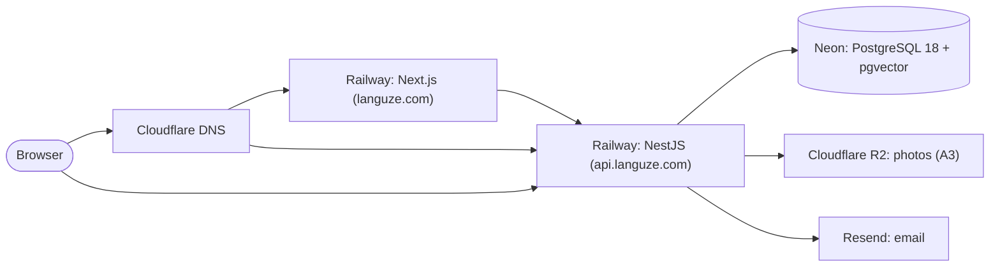

# Production deployment

Status: draft · Release 1.0

Where LanguZe runs in production, which providers were chosen and why, and what has to be true before a deployment counts as good. Local setup is in [local development](local-development.md).

## 1. Name and domain

Checked on 2026-09-20, before buying anything.

**Free and verified:** `languze.com`, `.app`, `.io`, `.co`, `.ai`, `.net`, `.org`, `.dev`, `.me`, `.xyz`; `languze.co.th`, `languze.in.th`, `languze.th`; the handles `@languze` on X, GitHub and YouTube; the npm package name `languze`. Each lookup was validated against known-registered controls, so a "free" result means the registry answered, not that the query failed. No app named LanguZe exists in the Apple App Store, and the only page on the web using the name is this repository.

**Not established:**

- **Trademarks were not searched.** Thailand's DIP portal, TMview and Justia all refuse automated access. A web search found nothing, which is not clearance. Clearance turns on whether a _confusingly similar_ mark is registered in the relevant Nice classes — 9 (downloadable software), 41 (language instruction), possibly 42 (SaaS) — and that is a judgement a Thai IP attorney makes, not a string comparison. Names in the same field worth putting in front of one: Langua, Lingoda, Lingvist.
- **Instagram, TikTok and Facebook handles are unknown.** All three answer HTTP 200 for handles that do not exist, so the check proves nothing. They need a manual look while signed in.

Registering a domain is not a trademark claim, so the domain can be bought now. The trademark search should happen before the name appears on paid marketing or a company registration.

**Domain (H1):** `languze.com`. The web app answers at the root, the API at `api.languze.com`. One registrable domain, as decision A1 requires — section 6 explains why that choice does the real work.

## 2. Topology



All four compute and data services sit in Singapore, the closest region to learners in Thailand.

## 3. Decisions

| ID  | Question                        | Decision                                                                                                                                                                                                                                                                                                                                         | Affects                   | Status               |
| --- | ------------------------------- | ------------------------------------------------------------------------------------------------------------------------------------------------------------------------------------------------------------------------------------------------------------------------------------------------------------------------------------------------ | ------------------------- | -------------------- |
| H1  | Which domain?                   | `languze.com`, web at the root and API at `api.languze.com`. One registrable domain keeps the session cookie first-party in Safari and in the LINE and Facebook in-app browsers (A1, NFR-018).                                                                                                                                                   | Everything                | Confirmed 2026-09-20 |
| H2  | Where do the applications run?  | Both as containers on Railway in Singapore (`asia-southeast1-eqsg3a`), Hobby plan. One platform and one bill; the API keeps a long-running process, which decision A2 depends on for in-memory rate limiting. Vercel was the alternative for the web app, but its free plan is restricted to non-commercial use and splitting hosts buys little. | Both apps; CI             | Confirmed 2026-09-20 |
| H3  | Where does the database run?    | Neon, Singapore (`aws-ap-southeast-1`), PostgreSQL 18 with pgvector 0.8.1 — the version the local Docker image already uses, and pgvector is in place for RAG later (ADR-0005) without a migration between providers.                                                                                                                            | API; migrations           | Confirmed 2026-09-20 |
| H4  | Who sends email?                | Resend. The free tier covers 3,000 messages a month, capped at 100 a day, which is far above a launch's volume of verification and reset mail. Amazon SES is cheaper at scale but starts in a sandbox that only sends to verified addresses.                                                                                                     | API; notifications        | Confirmed 2026-09-20 |
| H5  | How does the cookie reach both? | Better Auth sets the session cookie on `.languze.com` via `advanced.crossSubDomainCookies`, so both hosts receive it. The alternative, proxying the API through Next.js, would put every request including photo uploads through the web host. See section 6.                                                                                    | ADR-0003; API; web app    | Confirmed 2026-09-20 |
| H6  | How do photos get stored?       | Cloudflare R2, already decided as A3. No change here.                                                                                                                                                                                                                                                                                            | Worlds and images (later) | Confirmed 2026-09-19 |

## 4. Services

| Service  | Provider      | Region                   | Plan                      | Notes                                              |
| -------- | ------------- | ------------------------ | ------------------------- | -------------------------------------------------- |
| DNS      | Cloudflare    | —                        | Free                      | Registrar for `languze.com`; proxying off at first |
| Web      | Railway       | `asia-southeast1-eqsg3a` | Hobby, $5/mo incl. $5 use | Next.js container, one instance                    |
| API      | Railway       | `asia-southeast1-eqsg3a` | Same account              | NestJS container, one instance (A2)                |
| Database | Neon          | `aws-ap-southeast-1`     | Free to start             | PostgreSQL 18, pgvector 0.8.1                      |
| Email    | Resend        | —                        | Free                      | 3,000/month, 100/day                               |
| Photos   | Cloudflare R2 | —                        | Free tier to start        | Not used until worlds and images (increment 6)     |

Railway's Free and Trial plans are documented as unsuitable for long-running production services, so Hobby is the entry point rather than an upgrade to plan for.

## 5. Configuration

Names only. Values live in each provider's settings and never in the repository, and no secret is ever printed into a log or a pull request.

**API** — the variables `apps/api/src/config/env.validation.ts` already requires, with production values:

| Variable                                                                                    | Production value                                         |
| ------------------------------------------------------------------------------------------- | -------------------------------------------------------- |
| `NODE_ENV`                                                                                  | `production`                                             |
| `PORT`                                                                                      | Supplied by Railway                                      |
| `DATABASE_URL`                                                                              | Neon connection string, **pooled**                       |
| `DATABASE_URL_UNPOOLED`                                                                     | Neon **direct** string; migrations only (section 7)      |
| `WEB_ORIGIN`                                                                                | `https://languze.com`                                    |
| `AUTH_SECRET`                                                                               | Generated for production only; never reused from local   |
| `AUTH_URL`                                                                                  | `https://api.languze.com`                                |
| `COOKIE_DOMAIN`                                                                             | `.languze.com` — see section 6                           |
| `GOOGLE_CLIENT_ID`, `GOOGLE_CLIENT_SECRET`                                                  | From the LanguZe project in Google Cloud Console         |
| `LINE_CLIENT_ID`, `LINE_CLIENT_SECRET`                                                      | Channel ID and secret of the Thailand LINE Login channel |
| `MAIL_HOST`, `MAIL_PORT`                                                                    | `smtp.resend.com`, `587`                                 |
| `MAIL_USER`, `MAIL_PASSWORD`                                                                | `resend`, and a Resend API key                           |
| `MAIL_FROM`                                                                                 | `LanguZe <no-reply@languze.com>`, on the verified domain |
| `WORLD_LIMIT`, `DAILY_ANALYSIS_LIMIT`, `DAILY_TUTOR_MESSAGE_LIMIT`, `RATE_LIMIT_PER_MINUTE` | Defaults unless a limit proves wrong                     |

`MAIL_USER`, `MAIL_PASSWORD` and `COOKIE_DOMAIN` are empty by default, which is what local development needs: Maildev accepts anonymous mail, and on `localhost` the cookie is already shared.

**Web:** `NEXT_PUBLIC_API_URL` = `https://api.languze.com`. It is public by design — only a URL, called directly by the browser. It must be set as a **build-time** variable: Next.js inlines every `NEXT_PUBLIC_` value into the browser bundle while building, so setting it only at runtime leaves the browser calling `localhost`.

## 6. Sessions across subdomains

This is the part that works locally and silently breaks in production, and the reason this increment exists.

Locally the web app is `localhost:3003` and the API is `localhost:4001`. Cookies ignore port numbers, so both are the same host and the session cookie is shared without anything being configured.

In production they are different hosts. By default Better Auth sets a host-only cookie for `api.languze.com`. The browser sends it to the API, so client-side calls keep working — but the Next.js server at `languze.com` receives only cookies scoped to `languze.com`, so `getAccount()` sees no session and every page renders as though the learner were signed out.

The fix is to set the cookie on the parent domain, which the API does from `COOKIE_DOMAIN`:

```ts
advanced: {
  crossSubDomainCookies: { enabled: true, domain: '.languze.com' },
}
```

`domain` has to be given explicitly. Better Auth falls back to the hostname of `baseURL`, which here is `api.languze.com` — the exact value that does not work. The other attributes are already right: the library sets `httpOnly`, `sameSite: 'lax'`, `path: '/'`, and `secure` whenever the base URL is HTTPS.

`SameSite=Lax` is correct and does not need relaxing. "Same site" means the same registrable domain, so a request from `languze.com` to `api.languze.com` is same-site even though it is cross-origin. That is also why this arrangement survives Safari's tracking protection and the LINE and Facebook in-app browsers, where a cookie on a genuinely different domain would be dropped. CORS still applies, and the API already answers with the web origin and `credentials: true`.

This changes the configuration recorded in ADR-0003, which is updated in the same change.

## 7. Database and migrations

Neon holds the only copy of production data. Migrations are Prisma migrations, reviewed before they are applied, exactly as locally — `prisma migrate deploy`, never `migrate dev`, and never a hand-edit of a shared database.

**Migrations use the direct connection, not the pooled one.** Neon's pooled endpoint cannot run the schema statements Prisma issues, so `prisma7.config.ts` prefers `DATABASE_URL_UNPOOLED` when it is set and falls back to `DATABASE_URL` locally, where there is only one endpoint. The application itself keeps using the pooled URL.

The Prisma CLI ships in the API image for this reason — it is a runtime dependency, not a development one — so `prisma migrate deploy` runs inside the deployed container as a Railway pre-deploy command. The production connection string therefore lives only in Railway, and never in CI or on a developer's machine.

Before the first deployment the database is empty, so the first `migrate deploy` creates the four authentication tables from the existing migration.

Backups are Neon's own point-in-time restore on the free tier. Before Release 1.0 carries real learner data, confirm the retention window is long enough to notice a problem.

## 8. Deploying

`main` is the only branch that deploys. Each application has a Dockerfile at the workspace root, so Railway builds the same image locally and in production rather than inferring a build:

| Service | Dockerfile            | Build context       | Start                     |
| ------- | --------------------- | ------------------- | ------------------------- |
| API     | `apps/api/Dockerfile` | the repository root | `node dist/main.js`       |
| Web     | `apps/web/Dockerfile` | the repository root | `node apps/web/server.js` |

The web image needs `NEXT_PUBLIC_API_URL` as a **build argument**, not only an environment variable, for the reason in section 5.

A deployment is: merge to `main` → Railway builds both images → `prisma migrate deploy` runs as the API's pre-deploy command → check section 9. CI already runs lint, typecheck, tests and build on every pull request, so a merge to `main` has passed those before it deploys.

Both images can be built and run locally, which is how they were checked:

```bash
docker build -f apps/api/Dockerfile -t languze-api .
docker build -f apps/web/Dockerfile --build-arg NEXT_PUBLIC_API_URL=https://api.languze.com -t languze-web .
```

## 9. Before calling a deployment good

The walking skeleton is finished when all of these hold, checked by hand:

- `https://languze.com` serves the home page, and `https://api.languze.com/health` reports the API and database healthy.
- Sign-up sends a real verification email from Resend that arrives, and the link verifies the account.
- Sign-in, reload, and sign-out all behave — **in Chrome, Safari, the LINE in-app browser, and the Facebook in-app browser** (NFR-018). Open the site from a link inside LINE and inside Facebook; do not assume the in-app browsers behave like the standalone ones.
- After signing in, a full page reload still shows the signed-in state. This is the specific check that catches a cookie scoped to the wrong host.
- Password reset works end to end.
- A request with a wrong origin is still refused, and rate limiting still answers 429.
- No secret appears in any log line.

## 10. Cost

Roughly $5–15 a month to start: Railway Hobby at $5 including $5 of usage, with Neon, Resend, Cloudflare DNS and R2 all beginning on free tiers.

The domain is billed yearly and is the one cost that does not scale with traffic. Cloudflare Registrar sells at cost, so `languze.com` is the Verisign wholesale fee plus ICANN's: about **$10.44 a year** today, rising to about **$11.15** when the wholesale price moves from $10.26 to $10.97 on 1 November 2026 — under a dollar a month either way. Verisign may take up to three further 7% rises in this contract cycle, so treat the figure as drifting upward rather than fixed. Registrars that advertise a cheap first year and renew at $15–22 are the reason this is a Cloudflare decision.

Each free tier has a ceiling that real traffic will eventually reach; the point to re-read this section is when one of them does, not before.

## 11. Not set up yet

Deliberately absent, each waiting for a requirement that justifies it: Redis, RabbitMQ, a staging environment, a second API instance, and any CDN in front of R2. Adding one of these is an architecture decision, not a deployment detail.
