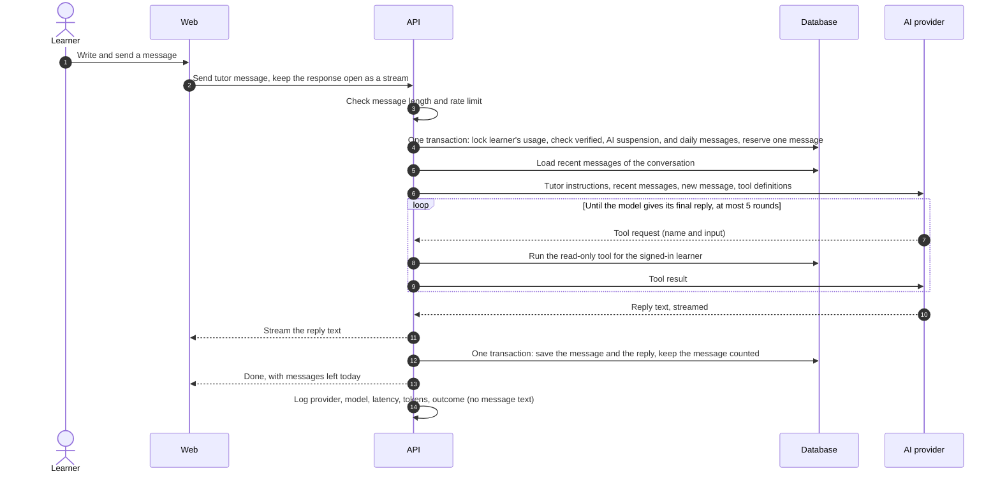

# AI tutor flow

- **Use case:** UC-070
- **Requirements:** FR-006, FR-070–FR-076, FR-080, FR-096, AIR-001, AIR-006–AIR-008, NFR-003
- **Decision:** replies are streamed with server-sent events (P6).

## 1. Send a message (UC-070)

- **Failure:** if the AI provider fails or times out at any point, the API releases the reserved message, saves nothing, and sends an error event; the learner can send the message again (FR-071, S6).
- **Limit:** the message is reserved at step 4, in a transaction that locks the learner's usage, so two messages sent at the same moment cannot both take the last one of the day. A released message no longer counts.
- **Disconnect:** if the learner leaves while the reply is streaming, the API still finishes and saves it, so the reply is there next time.
- **Bounds:** at most 5 tool rounds per message and an overall time limit keep cost and waiting time bounded; [ADR-0004](../architecture/adr/0004-ai-provider.md) sets them to 5 rounds and 30 seconds, both configurable.
- How many earlier messages are sent at step 6 is decided in the AI design.

## 2. Tools

Tools only read data, and they always act for the signed-in learner: none of them accepts a learner identifier from the model (FR-072). Each tool is built already bound to the learner, so whose data is read is settled before the model sees a tool.

| Tool              | Input                 | Returns                                                                                 |
| ----------------- | --------------------- | --------------------------------------------------------------------------------------- |
| `weak_words`      | How many (at most 20) | English word, Thai meaning, mastery level, number of mistakes, when last practised      |
| `recent_mistakes` | How many (at most 20) | English word, Thai meaning, what the learner typed (or "I don’t know"), when            |
| `word_details`    | An English word       | Thai meaning, example sentence, CEFR level, mastery level, the learner’s recent answers |

- Tool input from the model is validated like any external input; an unknown tool or invalid input returns an error to the model, not data. A count that makes no sense becomes the default rather than an error: the model guessing badly at a number is not a reason to refuse the learner an answer.
- A word the learner does not have is reported as not found, with a reason. Saying so is what stops the tutor inventing a history for it (FR-075).
- A requested word is matched the way an answer is checked (SRS 4.2), so a model asking for "the sofa" finds the word the learner knows as `sofa`.
- Tool results are data. What a learner once typed as an answer is passed to the model as quoted data, never as instructions.

## 3. What the AI provider receives

| Sent                                          | Never sent                                       |
| --------------------------------------------- | ------------------------------------------------ |
| Tutor instructions                            | Email address, display name, account identifiers |
| Recent messages of the learner's conversation | Photos, world names                              |
| The new message                               | Other learners' data                             |
| Results of the tools above                    | Anything not needed to answer (AIR-006)          |

## 4. Clear the conversation (FR-076)

After the learner confirms, the API deletes the conversation's messages in one transaction. Today's message count is kept, because it is recorded separately from the messages.

## 5. Points for the data model and API design

- A learner has one conversation of ordered messages, each with its role (learner or tutor), text, and time (V6).
- Daily tutor usage is recorded separately from the messages, so clearing the conversation does not reset it.
- The send-message endpoint returns a server-sent event stream with reply text, a final event with the remaining messages, and an error event **(P6)**.
