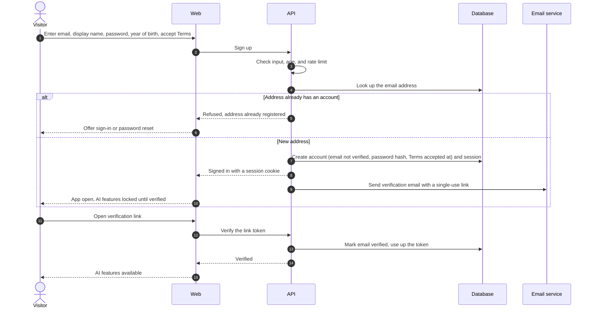
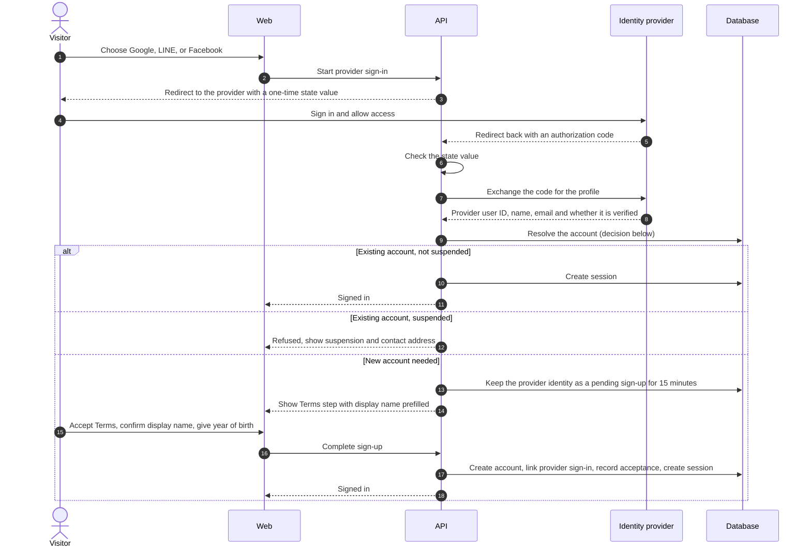
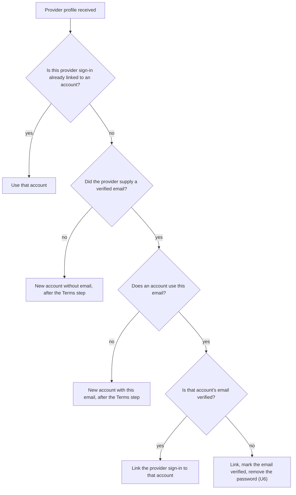
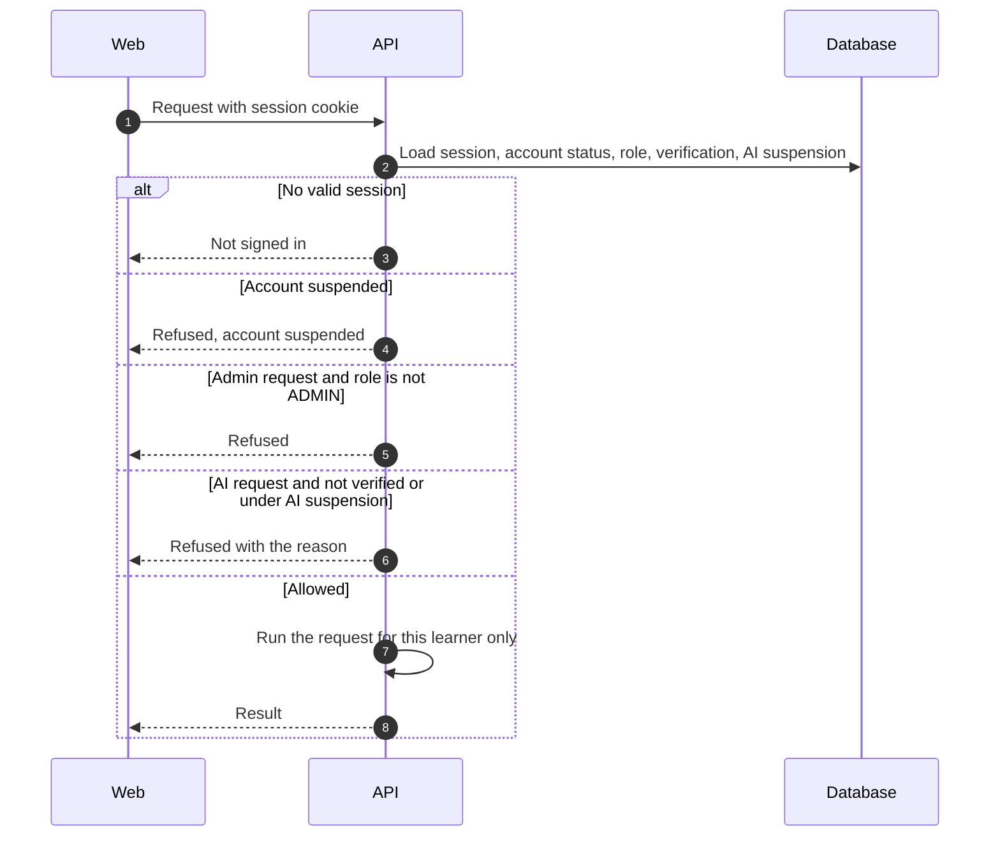
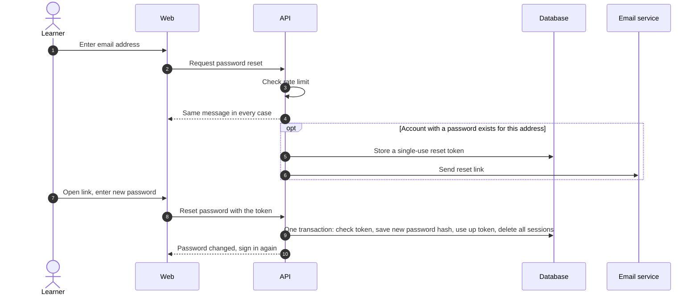
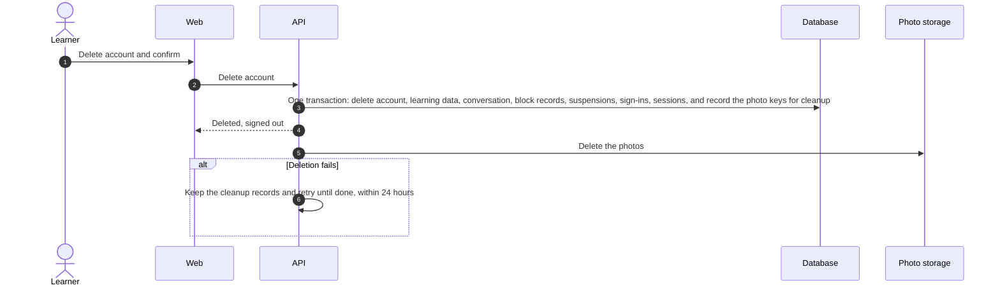

# Authentication flow

- **Use cases:** UC-001–UC-005
- **Requirements:** FR-001–FR-009, FR-090, FR-105, NFR-005, NFR-009, NFR-018, NFR-019
- **Decision:** Better Auth runs inside the API (P1).

## 1. Email sign-up and verification (UC-001)

- The email address is unique in the database, so two sign-ups with the same address at the same moment cannot both succeed; the second gets the "already registered" answer (FR-001).
- Sign-up with any method needs a year of birth by which the visitor turns 18 this year or earlier (FR-090, V20). Otherwise nothing is created, and a cookie stops the same browser from trying another year for 24 hours.
- The verification email is sent after the account is saved (step 9 follows step 7). If sending fails, the account stays and the learner can ask for a new email (UC-001 extension 4a).

## 2. Sign-in with Google, LINE, or Facebook (UC-003)

How the API resolves the account at step 9 (FR-009):

- An account counts as verified for AI features when its email is verified or it has any Google, LINE, or Facebook sign-in (SRS 1.3, V13, V14).
- The pending sign-up (step 13) is not a usable account: no session exists until the visitor accepts the Terms, and declining or waiting more than 15 minutes leaves nothing behind (FR-090, U5). The implementation may store it as a locked account that is removed on decline or expiry, as long as it cannot be used before acceptance.
- In the LINE and Facebook in-app browsers, the sign-in page offers only methods that work there, plus a way to open LanguZe in the default browser (NFR-018).

## 3. Authorizing every request

- Account status and role are read from the database on every request, not from data stored in the cookie. Removing the admin role or suspending an account therefore takes effect on the next request (NFR-019). Session caching in the cookie, which Better Auth offers, stays off.
- Suspending an account also deletes its sessions ([Moderation, section 3](moderation.md#3-admin-action-uc-103)); the status check above is a second line of defense.

## 4. Password reset (UC-004)

- The API answers before looking up the account and sending the email (step 4 comes first), so neither the message nor the response time reveals whether the address has an account (FR-005).

## 5. Sign-out and account deletion (UC-002, UC-005)

Signing out deletes the current session. Account deletion:

- Admin audit entries are kept with the account identifier only (FR-106).
- The same deletion runs when an admin deletes an account ([Moderation, section 3](moderation.md#3-admin-action-uc-103)).

## 6. Points for the data model and API design

- Email addresses are unique across accounts; accounts without an email address are allowed (FR-009).
- An account records when it accepted the Terms of Use and Privacy Policy.
- Sessions live in the database so they can be deleted: on sign-out, password reset, account suspension, and account deletion.
- Verification and reset tokens are single-use and expire.
- Photo deletions are recorded as cleanup records in the same transaction as the deletion that causes them, and a retry task works through them (NFR-009).
