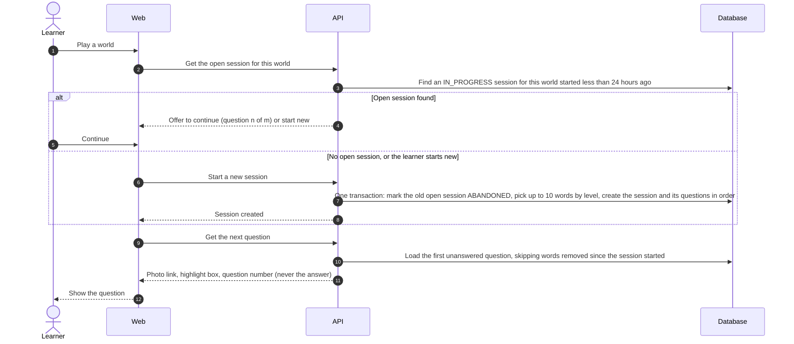
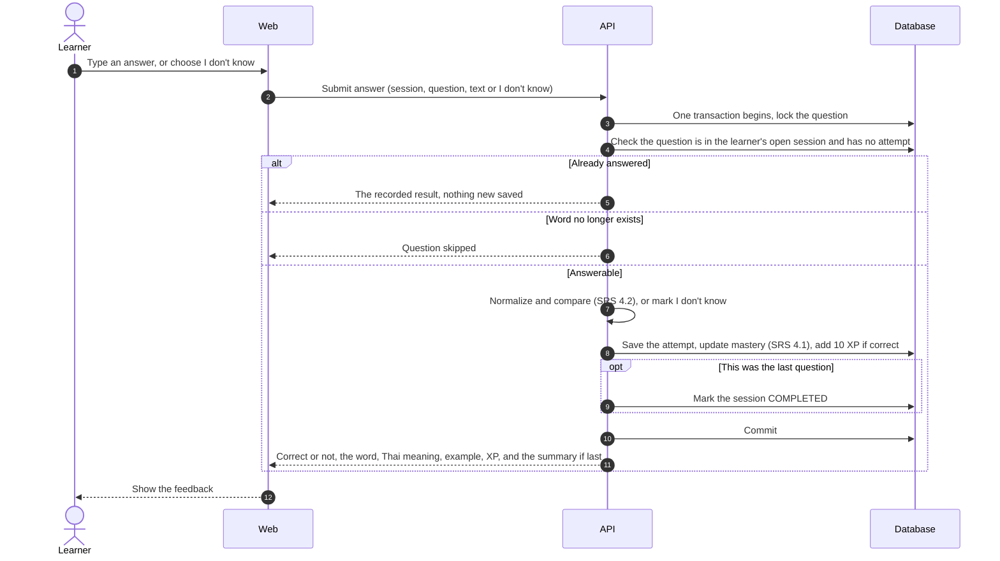
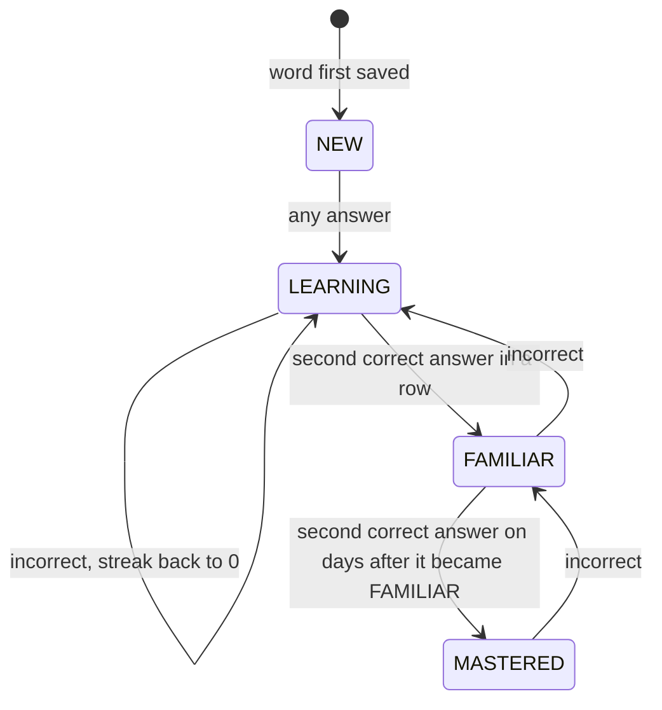
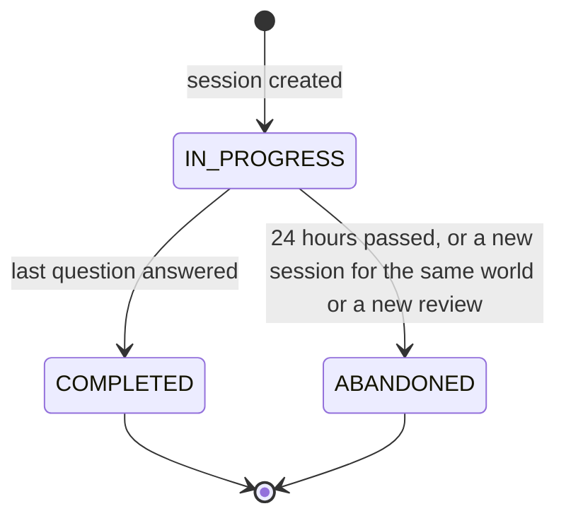

# Game session flow

- **Use cases:** UC-030, UC-031, UC-050
- **Requirements:** FR-030–FR-036, FR-040–FR-043, FR-050–FR-053, FR-060, SRS 4.1, SRS 4.2, NFR-011, NFR-012

A session is up to 10 questions, built when the learner starts a game for one world or a review across worlds. Game and review sessions work the same way after they are built; only the choice of words differs (sections 1 and 5).

## 1. Start or continue a game (UC-030)

- Words are picked `NEW` and `LEARNING` first, then `FAMILIAR`, then `MASTERED`, in random order within each level (FR-030). The questions and their order are fixed when the session is created.
- The response contains the highlight box and a short-lived photo link, but not the word or its accepted variants, which stay on the server until the learner answers (FR-032, S5).
- A reload or a return within 24 hours continues at step 9, with the next unanswered question (FR-036, V17).

## 2. Answer a question (UC-031)

- Steps 3–10 are one transaction: the attempt, the mastery update, and the XP are saved together or not at all (FR-034, NFR-011).
- The question is locked and each question can have at most one attempt, so a double tap or a repeated request cannot record two attempts or give XP twice (S5).
- Answer checking (SRS 4.2) and the mastery rules (SRS 4.1) are pure functions in the learning module, covered by unit tests with the examples from the SRS.
- An empty answer is rejected by the web app and by the API before step 3; nothing is recorded (UC-031 extension 1b).

## 3. Mastery levels (SRS 4.1)

The exact streak rules are in SRS section 4.1. Mastery belongs to the vocabulary word, so every world that contains the word shares it (FR-040).

## 4. Session status

- A session older than 24 hours is treated as `ABANDONED` when it is next read, so no background job is needed (V17).
- Only a `COMPLETED` session has a summary: correct answers, XP earned, and the words whose mastery level changed (FR-035). An abandoned session's answers still count.

## 5. Build a review session (UC-050)

A review is started and answered like a game (sections 1 and 2); only the choice of words differs (FR-050, FR-051):

1. Take the learner's vocabulary words that are not `MASTERED` and have at least one attempt.
2. Order them in three groups: words with mistakes (most recent mistake first); then the remaining `FAMILIAR` words; then the remaining `LEARNING` words (least recently practised first in both).
3. Keep the first 10.
4. For each word, use its occurrence from the learner's most recently created world that contains it.
5. If no word qualifies, create no session and tell the learner there is nothing to review (FR-053).

A learner has at most one open review session, and starting a new review abandons it.

## 6. Points for the data model and API design

- A session belongs to a learner and is either a game for one world or a review; it has a status, a start time, and an ordered list of questions.
- Each question points to an occurrence; the link is cleared if the occurrence is deleted, and the question is then skipped.
- An attempt belongs to one question (at most one attempt per question) and to the vocabulary word, and records the answer text or "I don't know", the result, and the time.
- Each vocabulary word holds its mastery level, streak, the day it last became `FAMILIAR`, and when it was last practised.
- The learner's total XP is a stored number that only increases (V4).
