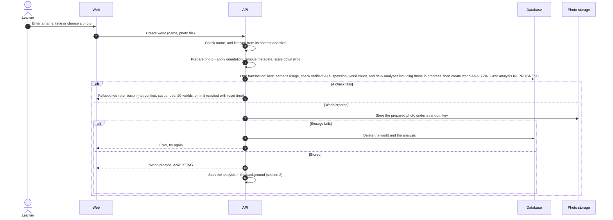
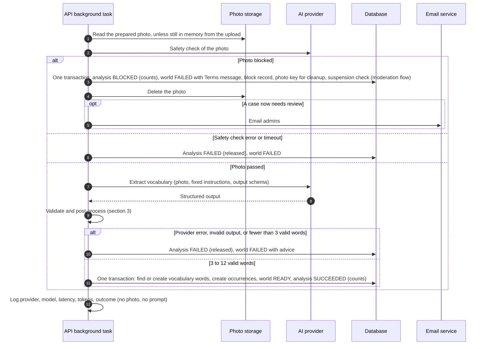
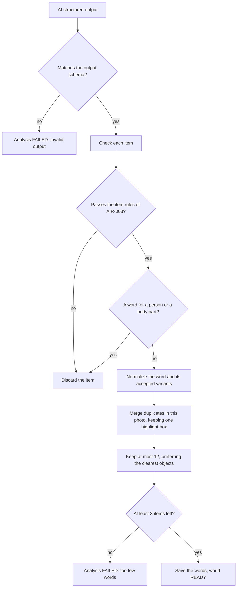
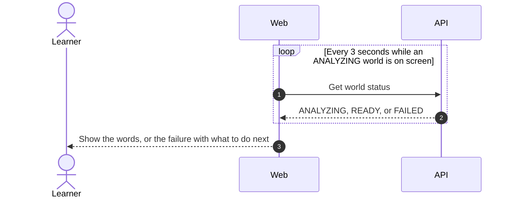
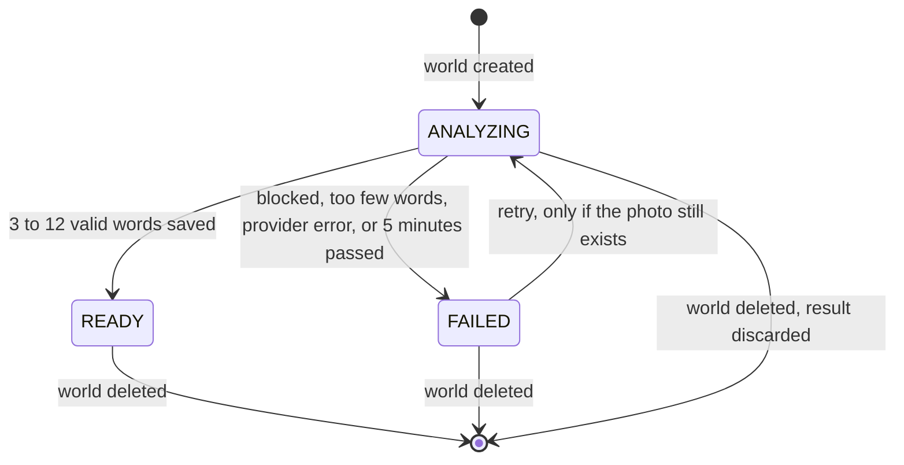
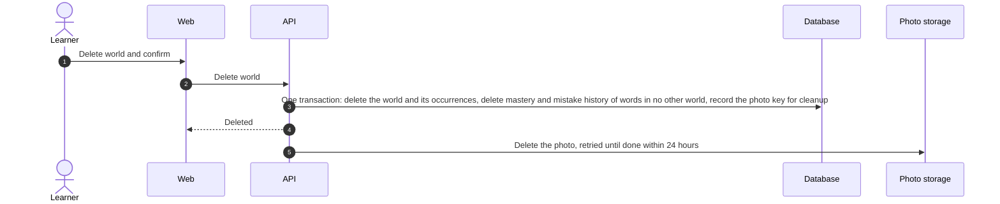

# Image to vocabulary flow

- **Use cases:** UC-010, UC-011, UC-020, UC-021, UC-022
- **Requirements:** FR-010–FR-017, FR-020–FR-027, FR-043, FR-091–FR-095, AIR-001–AIR-009, NFR-001, NFR-007–NFR-010
- **Decisions:** analysis runs as a background task in the API (P2); photos go through the API and are prepared before storage (P4, FR-017).

## 1. Create a world (UC-010)

- The limit check and the new analysis are saved in one transaction that locks the learner's usage (step 5), so two uploads at the same moment cannot both take the last analysis (FR-020, U2).
- The world and analysis are saved before the photo is stored, so a refusal never leaves a photo behind, and a storage failure is undone with a database delete (UC-010 minimal guarantee).

## 2. Analyse the photo (UC-020)

- The request to the AI provider contains the photo and fixed instructions only, never learner data (AIR-002, AIR-006). Text in the photo is image content, not instructions.
- A blocked photo is deleted from storage right after the transaction commits (step 4 after step 3). If deletion fails, the cleanup record keeps it on the retry list.
- The safety check and the extraction are two separate AI calls, safety first ([ADR-0004](../architecture/adr/0004-ai-provider.md)).
- If the world was deleted while the analysis ran, the result is discarded at the save step.
- **5-minute rule (V16):** when the API starts, and every minute afterwards, it marks analyses that have been `IN_PROGRESS` for more than 5 minutes as `FAILED` (released) and their worlds as `FAILED`. This catches analyses lost when the API restarts **(P2)**.

## 3. Validation and post-processing

The deterministic checks between the AI output and the database (AIR-003, AIR-004):

- Item rules (AIR-003): an English word of letters, spaces, or hyphens (1–40 characters); a Thai meaning containing Thai script; an example sentence containing the word or a variant; a CEFR level from A1 to C2; a highlight box inside the image with a non-zero area; accepted variants unique after normalization.
- People and body parts are filtered twice: the model is instructed not to return them, and a fixed list of people and body-part words removes any that slip through (FR-094, AIR-009).
- To keep "the clearest objects", the output schema includes a prominence value for each item; the AI design defines it.

## 4. Showing the result (FR-021)

Polling stops when the status is `READY` or `FAILED`, when the learner leaves the page, and after six minutes (P3). Six minutes is the 5-minute rule (V16) plus the minute the sweep can take to notice, so a page that has waited longer than that is waiting on something no amount of asking will fix: it says so and offers a refresh rather than spinning for ever.

Both the list of worlds and one world's page ask, so a learner who goes back to the list still sees the result arrive. Only worlds that are `ANALYZING` are asked about, and the status endpoint is used rather than reloading the page, because a reload signs new photo links each time and the pictures would flicker.

## 5. World status

Retrying (UC-021) repeats the checks and the transaction of section 1, step 5, for the existing world, then runs section 2 on the stored photo. A world whose photo was blocked has no photo, so it can only be deleted.

## 6. Deleting a world or removing a word (UC-011, UC-022)

Removing a word follows steps 2–4 for one occurrence, without the photo. Total XP never changes (V4).

## 7. Points for the data model and API design

- Each analysis is its own record with a start time and an outcome (`IN_PROGRESS`, `SUCCEEDED`, `BLOCKED`, `FAILED`). The daily count is the number of analyses started today (`Asia/Bangkok`) that are `IN_PROGRESS`, `SUCCEEDED`, or `BLOCKED`, so "releasing" an analysis just means it ends as `FAILED`.
- A vocabulary word belongs to the learner and is identified by its normalized English word and Thai meaning (FR-043); occurrences link it to a world with the highlight box, example sentence, CEFR level, and accepted variants.
- Highlight boxes are stored relative to the prepared photo (0–1), which is the photo the learner sees.
- Attempts and mistakes must keep their link to the vocabulary word when an occurrence or world is deleted, because a word still in another world keeps its mistake history (FR-015). Their link to the deleted occurrence is cleared, not cascaded.
- Total XP is stored on the learner and only increases; it is not recalculated from attempts, which can be deleted (V4).
- The API returns the photo as a short-lived signed link, never as a public address **(P4)**.
