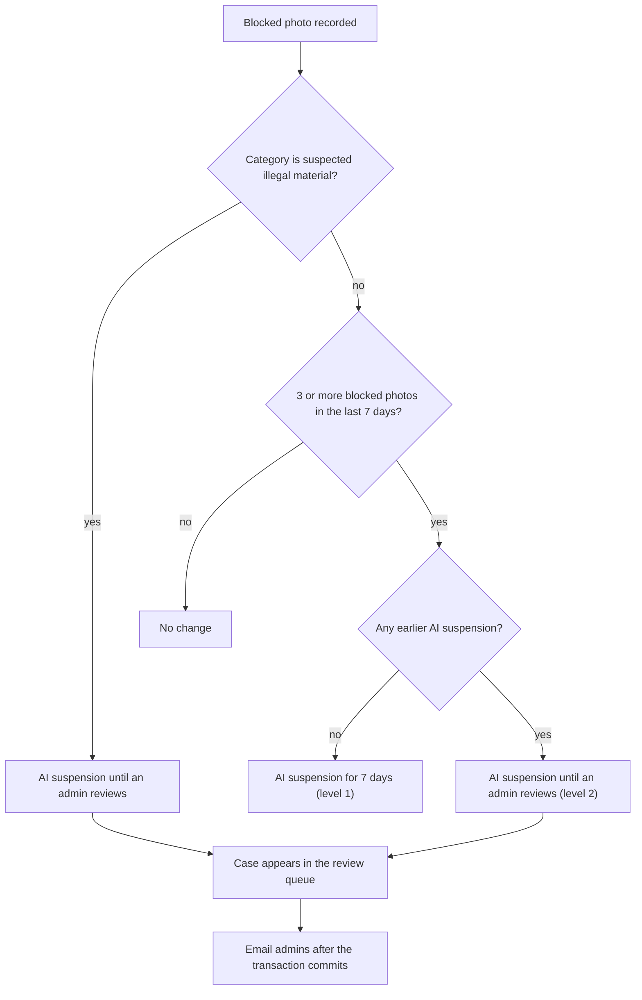
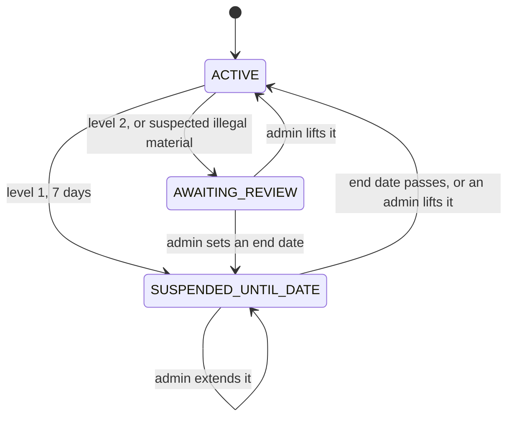
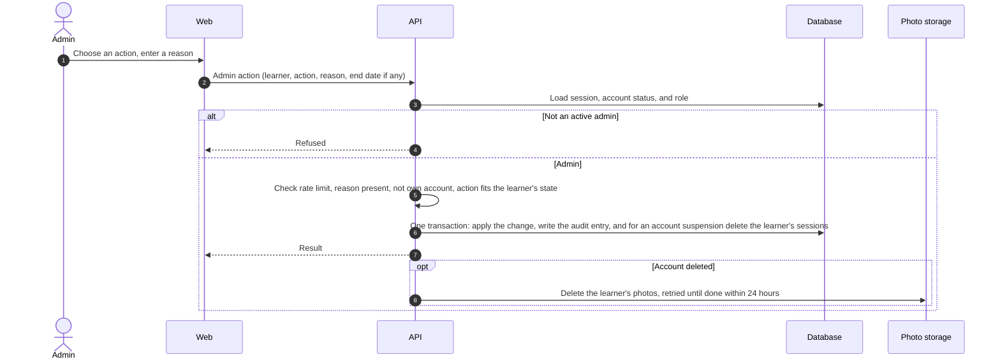

# Moderation flow

- **Use cases:** UC-090, UC-101, UC-102, UC-103
- **Requirements:** FR-095–FR-098, FR-100–FR-108, NFR-019, V15

## 1. After a blocked photo (UC-090)

The suspension check runs inside the transaction that records the blocked photo ([Image to vocabulary, section 2](image-to-vocabulary.md#2-analyse-the-photo-uc-020)):

- A suspension is its own record with a start time, a reason, and an end time; an empty end time means "until an admin reviews". Every suspension stays in the learner's history until the account is deleted (FR-104, U8).
- The notification email says only that a case needs review and links to the queue. It contains no learner data (FR-107).

## 2. AI suspension status of a learner

- `ACTIVE` means AI features are available. The status is worked out from the learner's suspension records when needed; an end date that has passed needs no background job.
- While a learner is not `ACTIVE`, photo analysis and the tutor are refused ([Authentication, section 3](authentication.md#3-authorizing-every-request)); everything else works (FR-096).

## 3. Admin action (UC-103)

- The change and its audit entry (admin, learner, action, reason, time) are saved in the same transaction, so there is never a change without an entry (FR-106).
- Deleting the learner's sessions in the same transaction makes an account suspension take effect immediately (FR-105).
- An account deletion by an admin removes the same data as the learner's own deletion ([Authentication, section 5](authentication.md#5-sign-out-and-account-deletion-uc-002-uc-005)).

## 4. Review queue and learner search (UC-101, UC-102)

- **Queue (FR-103):** learners whose account is active and whose current AI suspension awaits review, oldest first, with their block counts and categories. A reactivated account whose suspension still awaits review appears again automatically, because the queue is worked out from the current state rather than stored separately (U4).
- **Search (FR-108):** an exact email address or account ID returns at most one learner. There is no partial search and no list of all learners.
- **Moderation record (FR-104):** block records, AI suspension history, account age, and sign-in methods. The API never returns photos or tutor messages to the admin area.

## 5. Points for the data model and API design

- Block records hold the learner, time, and category, never the photo (FR-095).
- AI suspensions are records with a start, an optional end, a reason, and who lifted them and when.
- Audit entries hold the admin, the learner identifier, the action, the reason, and the time. They have no update or delete path in the application, and they keep the learner identifier after the account is deleted (FR-106).
- Admin routes are refused by default and allowed only for the `ADMIN` role, checked on the server for every request (FR-100, NFR-019).
