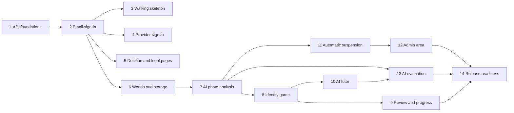

# LanguZe — Release 1.0 Build Plan

- **Document status:** Draft v0.1 — questions raised while writing, and their decisions, are in [Appendix A](#appendix-a-questions-raised-while-writing-the-plan)
- **Date:** 2026-09-19
- **Release covered:** Release 1.0
- **Source:** [user stories](../requirements/user-stories.md), [architecture overview](../architecture/overview.md), [data model](../architecture/data-model.md), [API design](../architecture/api-design.md)

## 1. Purpose

This plan orders the Release 1.0 work into increments. Each increment delivers a working slice, from the database to the screen, that can be tested and reviewed on its own. Each one becomes one pull request, or two when the API and web parts are large, and is done when its stories' acceptance criteria and the [Definition of Done](../requirements/user-stories.md#2-definition-of-done) are met.

The order follows dependencies and puts the riskiest assumptions first: sign-in across subdomains in real browsers, and AI boxes on real photos.

## 2. How increments work

- **Vertical slices:** each increment builds the API endpoints, the database migration for its tables, and the web pages together, so every merge leaves a usable product (B2).
- **Migrations grow with features:** each increment adds only the tables of the [data model](../architecture/data-model.md) that it uses, not the whole schema at once.
- **Fake AI in development:** a fake provider behind the AI interface returns fixed, realistic answers, so worlds, games, and the tutor can be built and tested without a Gemini key or cost (B4). The Gemini adapter is used for evaluation and production.
- **Branches:** one short-lived branch per increment, such as `feat/auth-email`, merged to `main` through a pull request (GitHub Flow).
- **Tracking:** one GitHub issue per increment in a "Release 1.0" milestone (B3).

## 3. Increments

| #   | Increment                          | Delivers                                                                                                                                                                                                                                                                                                                                       | Stories                                  | Size |
| --- | ---------------------------------- | ---------------------------------------------------------------------------------------------------------------------------------------------------------------------------------------------------------------------------------------------------------------------------------------------------------------------------------------------- | ---------------------------------------- | ---- |
| 1   | API foundations                    | The `/v1` prefix, the error format and codes, request IDs and structured logs, CORS with credentials and the `Origin` check, rate-limit infrastructure, limit configuration, the `Asia/Bangkok` day helper, a testing strategy document                                                                                                        | US-081; Definition of Done foundations   | S    |
| 2   | Email sign-up and sign-in          | The `auth` tables and first migration; Better Auth under `/auth` with email and password, year of birth and Terms at sign-up, verification and reset emails through Maildev, sessions, guards, `GET /v1/me`; web sign-up, sign-in, verification, and reset pages                                                                               | US-001–US-003, US-007, US-008            | L    |
| 3   | Production walking skeleton        | A check that the name LanguZe is free to use (trademarks, similar apps, domain, social media names) before buying the domain; a deployment document choosing the hosts, email provider, and domain; production and deployment from `main`; sign-in working across the two subdomains, in Safari and the LINE and Facebook in-app browsers (B1) | Confirms A1 and NFR-018 early            | M    |
| 4   | Google, LINE, and Facebook sign-in | Provider sign-in, the Terms step for new accounts, placeholder emails, the linking rules, in-app browser handling                                                                                                                                                                                                                              | US-004–US-006                            | M    |
| 5   | Account deletion and legal pages   | `DELETE /v1/me`; Terms of Use, Privacy Policy, and contact pages linked from every page                                                                                                                                                                                                                                                        | US-009, US-090                           | S    |
| 6   | Worlds and photo storage           | The `storage` module with SeaweedFS locally and signed links; photo preparation (FR-017); cleanup records and their retry task; creating, listing, opening, renaming, and deleting worlds, with the fake AI marking them `READY`                                                                                                               | US-010–US-014                            | L    |
| 7   | AI photo analysis                  | The AI interface with the fake and Gemini adapters; the safety check and blocked photos; extraction, validation, and post-processing; the background run, the 5-minute rule, the daily limit, retry, status polling, removing words                                                                                                            | US-020–US-022, US-080 (analyses), US-091 | L    |
| 8   | Identify game                      | Sessions, questions, answering, answer checking, mastery, XP, the summary, continuing an open session                                                                                                                                                                                                                                          | US-030–US-034, US-040–US-042             | L    |
| 9   | Review and progress                | Review sessions and the progress page                                                                                                                                                                                                                                                                                                          | US-050, US-051, US-060                   | M    |
| 10  | AI tutor                           | Conversation, read-only tools, the streamed reply, the daily message limit, clearing the conversation                                                                                                                                                                                                                                          | US-070–US-073, US-080 (messages)         | L    |
| 11  | Automatic AI suspension            | Suspension rules (V15, FR-098), AI access checks with explanations, admin notification emails                                                                                                                                                                                                                                                  | US-092, US-093                           | M    |
| 12  | Admin area                         | The promotion script, admin guard, review queue, learner search, moderation record, admin actions with the audit log and its trigger                                                                                                                                                                                                           | US-100–US-106                            | L    |
| 13  | AI evaluation                      | The 30-photo evaluation set and tutor cases (AIR-008, V8), run against Gemini with a paid key; model choice recorded (ADR-0004)                                                                                                                                                                                                                | PRD extraction metric                    | M    |
| 14  | Release readiness                  | Accessibility, performance, security, and privacy reviews; the pre-launch legal checks (SRS 3.10); final Terms and Privacy text; usability testing with at least 5 people; launch checklist                                                                                                                                                    | PRD release criteria                     | M    |

Sizes are relative: S is a few days of work for one developer, M about a week, and L one to two weeks.

## 4. Dependencies

- Increments 3, 4, and 5 depend only on email sign-in and can be done in any order; the walking skeleton goes first so real-browser sign-in is proven before more is built on it.
- Increment 5 deletes accounts before photos exist; increment 6 adds photo cleanup to account deletion.
- Increment 13 can start as soon as increment 7 works, to find weak spots in extraction early; its tutor cases need increment 10.

## 5. Milestones

| Milestone              | After increment | What a person can do                                               |
| ---------------------- | --------------- | ------------------------------------------------------------------ |
| Accounts in production | 3               | Sign up, verify, sign in, and reset a password on the real site    |
| First world            | 7               | Photograph a room and get checked vocabulary with highlight boxes  |
| Core learning loop     | 9               | Play Identify, see mastery change, review weak words, see progress |
| Complete journey       | 10              | Everything in the PRD's core journey, including the tutor          |
| Release 1.0            | 14              | Launch, after the release criteria of PRD section 7 are met        |

## Appendix A. Questions raised while writing the plan

| ID  | Question                                                                | Decision                                                                                                                                                                                                                                                                                                             | Affects                              | Status               |
| --- | ----------------------------------------------------------------------- | -------------------------------------------------------------------------------------------------------------------------------------------------------------------------------------------------------------------------------------------------------------------------------------------------------------------- | ------------------------------------ | -------------------- |
| B1  | When should LanguZe first run in production?                            | Early, as increment 3, right after email sign-in. Sign-in across two subdomains, cookies in Safari, and the LINE and Facebook in-app browsers are the riskiest assumptions of the design, and they can only be proven on a real domain. Deploying early also makes every later increment deploy the same proven way. | Increment order; deployment document | Confirmed 2026-09-19 |
| B2  | Build by layer (all of the API, then all of the web app) or by feature? | By feature: each increment includes its API, migration, and web pages. Every merge then leaves a product that works end to end, problems between the web app and the API show up at once, and progress is visible.                                                                                                   | All increments                       | Confirmed 2026-09-19 |
| B3  | How is progress tracked?                                                | A GitHub milestone "Release 1.0" with one issue per increment, each linking its stories. Pull requests then close their issue, and the milestone shows what is left. They are created after this plan is merged.                                                                                                     | GitHub project                       | Confirmed 2026-09-19 |
| B4  | How is AI work developed without cost or a paid key?                    | A fake AI provider behind the AI interface for development and automated tests, returning fixed, realistic results, including blocked photos and provider errors. Gemini is called only by the evaluation (increment 13), in production, and when a developer switches it on.                                        | Increments 6–10; tests               | Confirmed 2026-09-19 |
