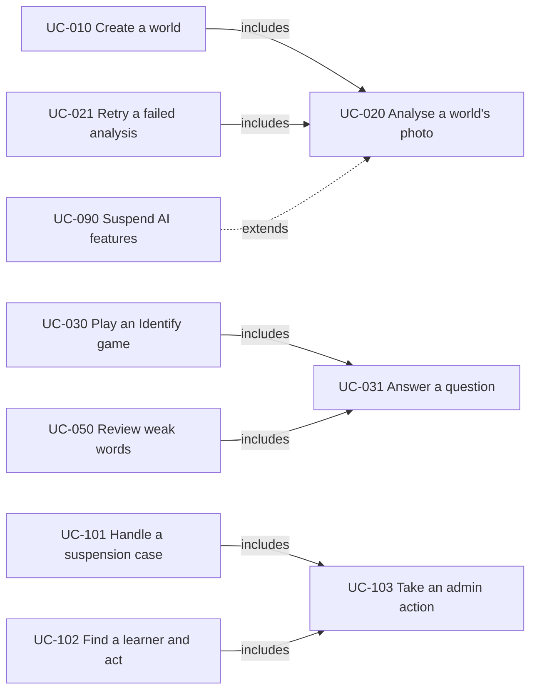

# LanguZe — Use Cases

- **Document status:** Draft v0.3 — questions raised while writing, and their decisions, are in [Appendix A](#appendix-a-questions-raised-while-writing-the-use-cases)
- **Date:** 2026-09-19
- **Release covered:** Release 1.0
- **Source:** [User stories](user-stories.md) v0.4 and [SRS](SRS.md) v0.8
- **Next documents:** process flows (authentication, image to vocabulary, game session, AI tutor)

## 1. Introduction

### 1.1 Purpose

User stories say what each user wants and how to test it. Use cases describe how each interaction unfolds, step by step, between the user, LanguZe, and the external systems involved, including what happens when something goes wrong. They are the input for the process flows, the API design, and the data model.

### 1.2 How to read a use case

- Use cases describe intent, not screens: "the learner submits an answer", not "the learner taps the green button".
- A **full** use case has:
  - **Primary actor:** who wants the goal.
  - **Supporting actors:** external systems that take part.
  - **Preconditions:** what is already true when it starts. Anything the system must check is a step, not a precondition.
  - **Trigger:** what starts it.
  - **Success guarantee:** what is true when the goal is reached.
  - **Minimal guarantee:** what is true however it ends, including failures.
  - **Main success scenario:** the numbered steps of the normal path.
  - **Extensions:** alternatives and failures, labelled by the step they branch from. `4a` is the first alternative at step 4; `*a` can happen at any step.
- A **brief** use case is a short paragraph, used where the interaction is simple.
- **Includes:** one use case always runs another as part of its steps (UC-030 includes UC-031). **Extends:** a use case adds behavior to another at a given step under a condition (UC-090 extends UC-020 when a photo is blocked).
- IDs follow the SRS section numbering, like the stories: `UC-001`–`UC-009` for accounts (SRS 3.1), `UC-010`–`UC-019` for worlds (SRS 3.2), and so on. Not every number is used. IDs are stable.
- Questions found while writing the use cases are recorded, with their decisions, in [Appendix A](#appendix-a-questions-raised-while-writing-the-use-cases).

### 1.3 Actors

| Actor             | Kind            | Description                                                                                                               |
| ----------------- | --------------- | ------------------------------------------------------------------------------------------------------------------------- |
| Visitor           | Person          | Someone without an account, or not signed in.                                                                             |
| Learner           | Person          | A signed-in account holder.                                                                                               |
| Verified learner  | Person          | A learner who can use AI features (SRS 1.3).                                                                              |
| Admin             | Person          | A learner with the admin role (SRS 3.11).                                                                                 |
| Operator          | Person          | The person who deploys and runs LanguZe, through configuration and scripts.                                               |
| Identity provider | External system | Google, LINE Login, or Facebook Login.                                                                                    |
| Email service     | External system | Sends verification, password reset, and admin notification emails.                                                        |
| Photo storage     | External system | Stores photos privately and serves them only to their owner.                                                              |
| AI provider       | External system | Runs the photo safety check, vocabulary extraction, and the tutor model, behind the application's AI interface (AIR-001). |
| LanguZe           | System          | Acts as the primary actor of use cases it starts itself (UC-020, UC-090).                                                 |

## 2. Overview

| ID     | Use case                                 | Primary actor    | Form  | Stories                        |
| ------ | ---------------------------------------- | ---------------- | ----- | ------------------------------ |
| UC-001 | Sign up with email                       | Visitor          | Full  | US-001, US-002, US-008         |
| UC-002 | Sign in and sign out with email          | Learner          | Brief | US-003                         |
| UC-003 | Sign in with Google, LINE, or Facebook   | Visitor          | Full  | US-004, US-005, US-006         |
| UC-004 | Reset a forgotten password               | Learner          | Brief | US-007                         |
| UC-005 | Delete my account                        | Learner          | Brief | US-009                         |
| UC-010 | Create a world from a photo              | Verified learner | Full  | US-008, US-010, US-080         |
| UC-011 | Manage my worlds                         | Learner          | Brief | US-011–US-014                  |
| UC-020 | Analyse a world's photo                  | LanguZe          | Full  | US-020, US-021, US-041, US-091 |
| UC-021 | Retry a failed analysis                  | Verified learner | Brief | US-021, US-091                 |
| UC-022 | Remove wrong words                       | Learner          | Brief | US-022                         |
| UC-030 | Play an Identify game                    | Learner          | Full  | US-030, US-033, US-034         |
| UC-031 | Answer a question                        | Learner          | Full  | US-031, US-032, US-040–US-042  |
| UC-050 | Review weak words                        | Learner          | Full  | US-034, US-050, US-051         |
| UC-060 | View my progress                         | Learner          | Brief | US-060                         |
| UC-070 | Chat with the AI tutor                   | Verified learner | Full  | US-008, US-070–US-073, US-080  |
| UC-080 | Configure usage limits                   | Operator         | Brief | US-081                         |
| UC-090 | Suspend AI features after blocked photos | LanguZe          | Full  | US-092, US-093                 |
| UC-100 | Promote an admin                         | Operator         | Brief | US-100                         |
| UC-101 | Handle a suspension case                 | Admin            | Full  | US-101, US-102, US-103         |
| UC-102 | Find a learner and act                   | Admin            | Brief | US-103, US-106                 |
| UC-103 | Take an admin action                     | Admin            | Full  | US-104                         |
| UC-104 | View the audit log                       | Admin            | Brief | US-105                         |

How the use cases depend on each other:

## 3. Use cases

### 3.1 Accounts and access (SRS 3.1)

#### UC-001 Sign up with email

- **Primary actor:** Visitor
- **Supporting actors:** Email service
- **Preconditions:** The visitor is not signed in.
- **Trigger:** The visitor chooses to sign up with email.
- **Success guarantee:** An account exists with the email address, display name, and password, and records when the Terms of Use and Privacy Policy were accepted. The learner is signed in, and a verification email was sent.
- **Minimal guarantee:** No account is created unless every field is valid and the Terms of Use and Privacy Policy are accepted. The password is never stored in readable form or logged.
- **Stories and requirements:** US-001, US-002, US-008; FR-001, FR-004, FR-006, FR-090, NFR-005

**Main success scenario**

1. The visitor enters an email address, a display name, and a password, and accepts the Terms of Use and Privacy Policy.
2. The system checks the input: a valid email address, a display name, a password of at least 8 characters, and acceptance.
3. The system creates the account with the email address not yet verified, records the acceptance time, and signs the learner in.
4. The system sends a verification email with a single-use link through the email service.
5. The learner uses LanguZe; every feature except photo analysis and the AI tutor is available.
6. Later, the learner opens the verification link.
7. The system marks the email address as verified. Photo analysis and the AI tutor become available.

**Extensions**

- **2a.** Input is invalid or the Terms of Use are not accepted: the system shows what to fix, and nothing is created. Resume at step 1.
- **3a.** The email address already has an account: the system says so and offers sign-in and password reset. Nothing is created.
- **4a.** The email service fails: the account is kept, and the learner can request a new verification email (6b).
- **6a.** The link has expired or was already used: the system says so and offers a new verification email.
- **6b.** The learner asks for a new verification email: the system sends one, within the rate limit (NFR-005).
- **\*a.** The learner tries photo analysis or the AI tutor before verifying: the system explains that the account needs verification and offers a new verification email (FR-006).

#### UC-002 Sign in and sign out with email

_Brief._ The learner enters an email address and password. If they match an account's password, the system starts a session; otherwise it says that the email or password is incorrect, without saying which. Only after a correct password does the system reveal that an account is suspended: it then starts no session and shows the suspension and the contact address. Signing out ends the session on that device. Sign-in attempts are rate-limited.

**Stories and requirements:** US-003; FR-002, FR-099, FR-105, NFR-005

#### UC-003 Sign in with Google, LINE, or Facebook

- **Primary actor:** Visitor
- **Supporting actors:** Identity provider
- **Preconditions:** The visitor is not signed in.
- **Trigger:** The visitor chooses Google, LINE, or Facebook on the sign-in page.
- **Success guarantee:** The learner is signed in to exactly one account, which has this provider sign-in linked and is treated as verified (FR-003, V13, V14). For a new account, the acceptance of the Terms of Use and Privacy Policy is recorded.
- **Minimal guarantee:** No account is created or linked unless the provider confirms the sign-in. Accounts are linked only on a verified email match (FR-009).
- **Stories and requirements:** US-004, US-005, US-006; FR-003, FR-009, FR-090, FR-105, NFR-018

**Main success scenario** (first sign-in, no existing account)

1. The visitor chooses a provider.
2. The system sends the visitor to the provider.
3. The visitor signs in at the provider and allows LanguZe to use their basic profile, and their email address where the provider offers it.
4. The provider returns the visitor to LanguZe with the result.
5. The system finds no account with this provider sign-in and no account whose verified email matches a verified email from the provider.
6. The system asks the visitor to accept the Terms of Use and Privacy Policy and to confirm a display name, prefilled from the provider profile.
7. The visitor accepts.
8. The system creates the account, links the provider sign-in, treats the account as verified, records the acceptance time, and signs the learner in. The account keeps the provider's email address only if the provider marks it as verified and no other account uses it; otherwise the account has no email address (FR-009).

**Extensions**

- **1a.** The visitor is in the LINE or Facebook in-app browser, where a method does not work (Google often blocks its sign-in there): the sign-in page offers the other methods and a way to open LanguZe in the device's default browser (NFR-018).
- **4a.** The visitor cancels at the provider, or the provider refuses: the system returns to the sign-in page. Nothing is created.
- **5a.** An account already has this provider sign-in: the system signs the learner in to it. If an admin has suspended the account, no session starts and the system shows the suspension and the contact address (FR-105).
- **5b.** The provider supplies a verified email address that matches an account's verified email: the system links this provider sign-in to that account and signs the learner in (FR-009).
- **5c.** The provider supplies a verified email address that matches an account whose email is not verified: the system links the provider sign-in to that account, marks the email as verified, and removes the account's password, so only the person who proved ownership of the email can sign in.
- **7a.** The visitor declines: nothing is created, and the system returns to the sign-in page.

#### UC-004 Reset a forgotten password

_Brief._ The learner enters an email address, and the system always shows the same message. If the address belongs to an account with a password, the system emails a single-use reset link through the email service; otherwise it sends nothing. Opening a valid link lets the learner set a new password of at least 8 characters; the system then ends all of the learner's existing sessions, and the learner signs in with the new password. For an expired or used link, the system explains and offers to send a new one. Requests are rate-limited.

**Stories and requirements:** US-007; FR-005, FR-009, NFR-005

#### UC-005 Delete my account

_Brief._ The learner chooses to delete their account. The system explains what will be removed and asks for explicit confirmation. On confirmation, in one transaction, the system deletes the account, all of the learner's data (worlds, vocabulary, attempts, mastery, XP, and tutor conversation), and the linked Google, LINE, and Facebook sign-ins; admin audit entries keep only the account identifier. Block records and AI suspensions are deleted with the account. The learner's sessions end. The system deletes the learner's photos from photo storage within 24 hours, retrying a failed deletion until it succeeds. An admin's account deletion (UC-103) has the same effect.

**Stories and requirements:** US-009; FR-007, FR-106, NFR-009

### 3.2 Worlds and photos (SRS 3.2)

#### UC-010 Create a world from a photo

- **Primary actor:** Verified learner
- **Supporting actors:** Photo storage
- **Preconditions:** The learner is signed in.
- **Trigger:** The learner chooses to create a world.
- **Success guarantee:** A world exists with its name and privately stored photo and the status `ANALYZING`; one of today's analyses is reserved for it, and UC-020 has started.
- **Minimal guarantee:** If no world is created, no photo is kept and no analysis is used.
- **Stories and requirements:** US-008, US-010, US-080; FR-006, FR-010, FR-011, FR-012, FR-017, FR-020, FR-080, FR-096, NFR-005, NFR-007, NFR-014

**Main success scenario**

1. The learner chooses to create a world.
2. The system checks that the learner is verified, is not under an AI suspension, has fewer than 20 worlds, and has an analysis left today, and shows how many analyses are left. Analyses still in progress count as used.
3. The learner enters a name and takes or chooses a photo.
4. The learner submits.
5. The system checks the name (1–50 characters) and the file: JPEG, PNG, or WebP, judged by its content, and at most 10 MB.
6. The system repeats the checks of step 2, prepares the photo (FR-017) and stores it privately, creates the world with the status `ANALYZING`, and reserves one of today's analyses for it.
7. The system starts UC-020 without making the learner wait, and shows the world as `ANALYZING`. The learner may leave.

**Extensions**

- **2a.** The learner is not verified: the system explains how to verify and offers a new verification email (FR-006). The use case ends.
- **2b.** The learner is under an AI suspension: the system shows why, until when (or that a review is pending), and how to contact LanguZe (FR-096). The use case ends.
- **2c.** The learner has 20 worlds: the system explains the limit and that deleting a world frees a place. The use case ends.
- **2d.** No analysis is left today: the system shows when the limit resets (FR-080). The use case ends.
- **5a.** The name is invalid: the system shows the rule. Resume at step 3.
- **5b.** The file is invalid: the system shows why it was rejected. Resume at step 3.
- **6a.** A check of step 2 now fails, for example because another upload used the last analysis: as 2a–2d. Nothing is stored.
- **6b.** Photo storage fails: the system shows an error. No world is created and no analysis is used; the learner can try again.

#### UC-011 Manage my worlds

_Brief._ The learner's world list shows each world's name, thumbnail, analysis status, word count, and number of mastered words, or an invitation to create a first world. Opening a world shows its photo and words, each with its Thai meaning, CEFR level, and the learner's mastery level; a `FAILED` world shows what the learner can do next (UC-021). The learner can rename a world (1–50 characters). Deleting a world requires confirmation; in one transaction the system removes the world and its occurrences, and removes the mastery and mistake history of any vocabulary word no longer in another of the learner's worlds. Total XP does not change (V4). The photo is deleted from photo storage within 24 hours. A world can be deleted while `ANALYZING`; the analysis result is then discarded. Photos and worlds are served only to their owner.

**Stories and requirements:** US-011, US-012, US-013, US-014; FR-008, FR-013, FR-014, FR-015, FR-016, FR-021, NFR-008, NFR-009

### 3.3 AI vocabulary extraction (SRS 3.3)

#### UC-020 Analyse a world's photo

- **Primary actor:** LanguZe
- **Supporting actors:** AI provider, Photo storage
- **Preconditions:** The world is `ANALYZING`, its photo is stored, and one of today's analyses is reserved for it.
- **Trigger:** UC-010 or UC-021 starts the analysis.
- **Success guarantee:** The world is `READY` with 3–12 validated words, each linked to one of the learner's vocabulary words. The reserved analysis counts toward today's limit.
- **Minimal guarantee:** The world ends `READY` or `FAILED` and never stays `ANALYZING`. Vocabulary is saved completely or not at all. A photo that fails the safety check is deleted and never shown. The AI provider never receives learner data other than the photo.
- **Stories and requirements:** US-020, US-021, US-041, US-091; FR-020–FR-025, FR-043, FR-091–FR-095, AIR-001–AIR-005, AIR-007, AIR-009, NFR-001, NFR-010

**Main success scenario**

1. The system sends the photo to the AI provider's safety check through the AI interface. The check looks for the content the Terms of Use prohibit (FR-091).
2. The photo passes the safety check.
3. The system asks the AI provider for structured vocabulary output for the photo. The request contains the photo and fixed instructions only; text inside the photo is treated as image content, never as instructions (AIR-002).
4. The AI provider returns structured output.
5. The system validates each item (AIR-003), discards invalid items and any word for people or body parts (FR-094, AIR-009), normalizes the words, merges duplicates, and keeps at most 12 of the clearest objects (AIR-004, FR-024).
6. For each item, the system finds the learner's vocabulary word with the same normalized English word and Thai meaning, or creates a new one at `NEW` (FR-043).
7. In one transaction, the system saves the occurrences and sets the world to `READY`. The reserved analysis counts toward today's limit.
8. The system records the provider, model, latency, token usage, and outcome of each AI call, without the photo or the prompts (AIR-007).
9. The learner sees the world as `READY` the next time they view it.

**Extensions**

- **1a.** The safety check fails to run or returns an error: the system does not continue without it. As 4a.
- **2a.** The photo fails the safety check (a blocked photo): the system deletes the photo from photo storage immediately, records the learner, time, and block category (FR-095), and sets the world to `FAILED` with a general message that links to the Terms of Use. The reserved analysis counts toward today's limit (FR-093). UC-090 runs. The use case ends.
- **4a.** The AI provider fails, times out, or returns output that does not match the expected structure: the world becomes `FAILED` with a message offering retry or deletion. The reservation is released (FR-025, NFR-010).
- **5a.** Fewer than 3 valid items remain: the world becomes `FAILED` with advice to take a clearer photo of a place with more objects. The reservation is released (FR-024, FR-025).
- **7a.** Saving fails: nothing is saved. As 4a.
- **7b.** The world was deleted while the analysis ran: the result is discarded.
- **\*a.** The analysis has not finished 5 minutes after it started, for example because the server restarted: the world becomes `FAILED` as in 4a.

Whether the safety check and the extraction are one AI call or two is decided in the AI design (planned ADR for the AI provider abstraction).

#### UC-021 Retry a failed analysis

_Brief._ From a `FAILED` world that still has its photo, the verified learner chooses retry. The system repeats the checks of UC-010 step 2, sets the world to `ANALYZING`, reserves one of today's analyses, and runs UC-020 on the same photo. A world whose photo was blocked offers only deletion, because its photo no longer exists. To use a different photo, the learner creates a new world.

**Stories and requirements:** US-021, US-091; FR-025

#### UC-022 Remove wrong words

_Brief._ In a `READY` world with more than one word, the learner removes a word. The system removes that occurrence; if no other world of the learner contains the vocabulary word, its mastery and mistake history are removed too. Total XP does not change. The last word cannot be removed; the system suggests deleting the world instead (V5). Word text cannot be edited (PRD Q3).

**Stories and requirements:** US-022; FR-026, FR-027

### 3.4 Identify game (SRS 3.4, 3.5)

#### UC-030 Play an Identify game

- **Primary actor:** Learner
- **Supporting actors:** None
- **Preconditions:** The learner is signed in and owns a `READY` world.
- **Trigger:** The learner starts a game from the world.
- **Success guarantee:** Every submitted answer is recorded with its mastery update and XP (UC-031), and the learner saw the session summary.
- **Minimal guarantee:** Submitted answers stay recorded; unanswered questions have no effect (FR-036).
- **Stories and requirements:** US-030, US-033, US-034; FR-030, FR-031, FR-035, FR-036, NFR-012

**Main success scenario**

1. The learner starts a game for a `READY` world.
2. The system builds and saves a session of up to 10 of the world's words: `NEW` and `LEARNING` first, then `FAMILIAR`, then `MASTERED`, in random order within each level (FR-030).
3. The system shows the next question: the world's photo with the word's highlight box, an answer box, and an "I don't know" option. The correct answer is not sent to the browser (FR-032).
4. The learner answers the question (UC-031).
5. Steps 3–4 repeat until every question is answered.
6. The system shows the summary: the number of correct answers, the XP earned, and the words whose mastery level changed, with their new level (FR-035).

**Extensions**

- **1a.** The world is not `READY`: the system does not start a game.
- **1b.** The world has an unfinished session that is still open: the system offers to continue it at the next unanswered question or to start a new one. Starting a new one closes the old session without a summary.
- **3a.** The question's word was removed, or its world deleted, since the session started: the system skips the question.
- **\*a.** The learner leaves before the last question, or the page reloads: answered questions stay recorded. The session stays open for 24 hours (V17), or until the learner starts a new session for the same world; opening it again continues at step 3 with the next unanswered question, and the summary at step 6 covers the whole session. A session that closes unfinished has no summary (FR-036).

#### UC-031 Answer a question

- **Primary actor:** Learner
- **Supporting actors:** None
- **Preconditions:** The question belongs to a session of the learner and has not been answered.
- **Trigger:** The learner submits an answer or chooses "I don't know".
- **Success guarantee:** One attempt is recorded, the vocabulary word's mastery is updated by SRS 4.1, 10 XP is awarded if the answer is correct, and a mistake is kept if it is incorrect, all in one transaction. The learner saw the feedback.
- **Minimal guarantee:** The attempt, mastery update, and XP are saved together or not at all (FR-034, NFR-011). A question never has more than one attempt, even if answers arrive at the same time.
- **Stories and requirements:** US-031, US-032, US-040, US-041, US-042; FR-031–FR-034, FR-040–FR-042, FR-060, SRS 4.1, SRS 4.2, NFR-011

**Main success scenario**

1. The learner types an answer and submits it.
2. The system confirms that the question belongs to the learner's session and has no attempt yet.
3. The system normalizes the answer and the accepted answers (SRS 4.2) and compares them.
4. In one transaction, the system records the attempt (answer text, result, occurrence, session, and time), updates the vocabulary word's mastery by SRS 4.1, which every world containing the word shares (FR-040), awards 10 XP if the answer is correct, and keeps a mistake if it is incorrect (FR-042).
5. The system shows whether the answer was correct, the correct word, its Thai meaning, the example sentence, and, for a correct answer, the XP earned (FR-033).

**Extensions**

- **1a.** The learner chooses "I don't know": the system skips step 3. The attempt is incorrect, without answer text, and the mistake is marked "I don't know" (FR-032). Continue at step 4.
- **1b.** The answer is empty: the system asks for a word or "I don't know". Nothing is recorded.
- **2a.** The question already has an attempt, for example after a repeated submission: the system shows the recorded result. Nothing new is recorded and no XP is given (FR-034).
- **2b.** The question's word no longer exists: the system says so. Nothing is recorded.
- **4a.** The transaction fails: nothing is saved. The learner sees an error and can submit again.

### 3.5 Personalized review (SRS 3.6)

#### UC-050 Review weak words

- **Primary actor:** Learner
- **Supporting actors:** None
- **Preconditions:** The learner is signed in.
- **Trigger:** The learner starts a review.
- **Success guarantee:** As UC-030.
- **Minimal guarantee:** As UC-030.
- **Stories and requirements:** US-034, US-050, US-051; FR-036, FR-050, FR-051, FR-052, FR-053

**Main success scenario**

1. The learner starts a review.
2. The system selects up to 10 of the learner's vocabulary words that are not `MASTERED` and have at least one attempt, in this order: words with mistakes (most recent mistake first), then `FAMILIAR` words, then `LEARNING` words (least recently practised first in both) (FR-050).
3. For each word, the system uses its occurrence from the learner's most recently created world that contains it (FR-051), and saves the session.
4. Questions proceed as in UC-030 steps 3–5, including UC-031 (FR-052).
5. The system shows the summary as in UC-030 step 6.

**Extensions**

- **1a.** An unfinished review session is still open: the system offers to continue it or to start a new review. Starting a new review closes the old session without a summary.
- **2a.** No word qualifies: the system says that there is nothing to review and suggests playing a world (FR-053). The use case ends.
- **\*a.** The learner leaves before the last question, or the page reloads: as UC-030 extension \*a.

### 3.6 Progress and XP (SRS 3.7)

#### UC-060 View my progress

_Brief._ The progress page shows the learner's total XP, the number of vocabulary words at each mastery level, and each world's word and mastery counts. XP is 10 per correct answer and never decreases (V4).

**Stories and requirements:** US-060; FR-060, FR-061

### 3.7 AI tutor (SRS 3.8)

#### UC-070 Chat with the AI tutor

- **Primary actor:** Verified learner
- **Supporting actors:** AI provider
- **Preconditions:** The learner is signed in.
- **Trigger:** The learner opens the tutor.
- **Success guarantee:** The learner's message and the tutor's reply are saved in the learner's single conversation, and the message counts toward today's limit.
- **Minimal guarantee:** The AI provider never receives the learner's email address, display name, or photos, or any other learner's data. Tutor tools never change data. Logs never contain message text.
- **Stories and requirements:** US-008, US-070, US-071, US-072, US-073, US-080; FR-006, FR-070–FR-076, FR-080, FR-096, AIR-006, AIR-007, NFR-003

**Main success scenario**

1. The learner opens the tutor.
2. The system checks that the learner is verified and not under an AI suspension, and shows the conversation and the number of messages left today.
3. The learner writes a message of up to 1,000 characters and sends it.
4. The system checks the message length and the daily limit.
5. The system sends the AI provider the tutor instructions, recent messages of the conversation, and the new message, and makes the read-only tools available (AIR-006).
6. The model asks for data through the tools. The system runs each tool for the signed-in learner only (weak words, recent mistakes with the learner's answers, or one word's details) and returns the results (FR-072).
7. The model replies in Thai with English examples at CEFR A1–B1 level, keeps to English learning, and bases statements about the learner on tool results (FR-073–FR-075).
8. The system streams the reply to the learner (NFR-003), saves the message and reply to the conversation, counts the message toward today's limit, and records the AI call's metadata without message text (AIR-007).

**Extensions**

- **2a.** The learner is not verified or is under an AI suspension: as UC-010 2a and 2b.
- **4a.** The message is longer than 1,000 characters: it cannot be sent, and the system shows the limit.
- **4b.** The daily limit is reached: the input is disabled and shows when the limit resets (FR-071).
- **6a.** The model asks for a tool that does not exist, or gives invalid tool input: the system returns an error to the model, not data. Tools never take a learner identifier from the model; they always act for the signed-in learner.
- **7a.** The AI provider fails or times out: the learner sees an error and can send the message again. Nothing is saved, and the message does not count toward the limit (FR-071).
- **\*a.** The learner clears the conversation and confirms: the system deletes it. Today's message count does not change (FR-076).

How many earlier messages are sent to the model at step 5 is decided in the AI design.

### 3.8 Usage limits (SRS 3.9)

#### UC-080 Configure usage limits

_Brief._ The operator sets the worlds per learner, analyses per day, and tutor messages per day in an environment's configuration. When the application starts, it validates them and refuses to start with an error that names an invalid setting. Unset values use the SRS values: 20 worlds, 10 analyses per day, and 30 tutor messages per day.

**Stories and requirements:** US-081; FR-012, FR-081, NFR-017

### 3.9 Content policy and safety (SRS 3.10)

#### UC-090 Suspend AI features after blocked photos

- **Primary actor:** LanguZe
- **Supporting actors:** Email service
- **Preconditions:** A blocked photo was just recorded for the learner (UC-020 extension 2a).
- **Trigger:** UC-020 extension 2a.
- **Success guarantee:** The learner's AI features are suspended when V15 or FR-098 requires it, and admins are emailed about every case that needs review.
- **Minimal guarantee:** A suspension is always backed by the block records that caused it. The learner's other features stay available.
- **Stories and requirements:** US-092, US-093; FR-096, FR-098, FR-099, FR-103, FR-107

**Main success scenario**

1. The system counts the learner's blocked photos in the last 7 days, including this one.
2. The count has reached 3, and the learner has never had an AI suspension.
3. The system suspends the learner's AI features for 7 days (level 1 of V15).
4. When the learner opens world creation or the tutor, the system shows why, until when, and how to contact LanguZe (FR-096, FR-099).
5. After 7 days, AI features are available again without any action.

**Extensions**

- **1a.** The block category is suspected illegal material: the system suspends the learner's AI features immediately until an admin reviews the case, adds the case to the review queue, and emails admins (FR-098, FR-107). Further handling follows Thai law (SRS 3.10 pre-launch check). The use case ends.
- **2a.** The count is below 3: nothing changes. The use case ends.
- **2b.** The learner has had an earlier AI suspension: the system suspends AI features until an admin reviews the case (level 2 of V15), adds the case to the review queue, and emails admins (FR-107). At step 4, the learner sees that a review is pending instead of an end date.

### 3.10 Administration (SRS 3.11)

#### UC-100 Promote an admin

_Brief._ The operator lists accounts, by email address or account ID, in the deployment configuration and runs the promotion script. The script gives the admin role to listed accounts that exist, reports entries that match no account, and creates nothing. Running it again changes nothing more. No feature of the application grants or removes the admin role.

**Stories and requirements:** US-100; FR-100, FR-101

#### UC-101 Handle a suspension case

- **Primary actor:** Admin
- **Supporting actors:** Email service
- **Preconditions:** The admin is signed in.
- **Trigger:** An email says that a case needs review, or the admin opens the review queue.
- **Success guarantee:** The case is resolved by an admin action with a reason, which the audit log records, and the case leaves the queue.
- **Minimal guarantee:** The admin never sees the learner's photos or tutor conversation. Nothing changes without an audit entry.
- **Stories and requirements:** US-101, US-102, US-103; FR-097, FR-100, FR-102, FR-103, FR-104, FR-107, NFR-019

**Main success scenario**

1. The admin opens the admin area. The system confirms the admin role on the server (FR-100).
2. The admin opens the review queue. The system lists learners whose AI suspension awaits review, oldest first, with their block counts and categories (FR-103).
3. The admin opens a case. The system shows the learner's block records, AI suspension history, account age, and sign-in methods (FR-104).
4. The admin decides and takes an action with a reason (UC-103).
5. The case leaves the queue once the AI suspension no longer awaits review (lifted, or given an end date) or the account is suspended or deleted.

**Extensions**

- **1a.** The account does not have the admin role: the system refuses, and no admin page or data is shown (FR-100, FR-102).
- **2a.** No case awaits review: the system says that the queue is empty.

#### UC-102 Find a learner and act

_Brief._ Used for appeals and personal-data requests that arrive by email (FR-099). The admin enters an exact email address or account ID. The system shows the matching learner's moderation record, as in UC-101 step 3, or says that no learner matches. There is no partial search and no list of all learners. The admin may then take an action (UC-103), noting any appeal in the reason.

**Stories and requirements:** US-103, US-106; FR-099, FR-104, FR-108

#### UC-103 Take an admin action

- **Primary actor:** Admin
- **Supporting actors:** None
- **Preconditions:** The admin is viewing a learner's moderation record (UC-101 or UC-102).
- **Trigger:** The admin chooses an action.
- **Success guarantee:** The change and its audit entry (admin, learner, action, reason, and time) are saved together (FR-106), and the change takes effect immediately.
- **Minimal guarantee:** Without the admin role, without a reason, or on the admin's own account, nothing changes.
- **Stories and requirements:** US-104; FR-105, FR-106, NFR-019

**Main success scenario**

1. The admin chooses an action: lift the AI suspension, extend it until a date, suspend the account, reactivate the account, or delete the account.
2. The admin enters a reason, noting any appeal received by email.
3. The system checks the admin role on the server, that a reason is given, that the learner is not the admin, and that the action fits the learner's state (for example, only a suspended account can be reactivated).
4. In one transaction, the system applies the change and writes the audit entry. An account suspension also ends all of the learner's sessions in the same transaction; an account deletion removes the account as in UC-005.
5. The system shows the result. A lifted AI suspension makes AI features available at once; an extended one keeps them off until the chosen date.

**Extensions**

- **3a.** A check fails: the system explains why. Nothing changes.
- **3b.** The chosen end date is not in the future: the system asks for a later date.
- **3c.** The admin exceeds the rate limit for admin actions (NFR-019): the system asks them to wait.
- **4a.** Saving fails: nothing changes, and the system shows an error.

#### UC-104 View the audit log

_Brief._ The audit log lists admin actions, newest first, with the admin, the learner identifier, the action, the reason, and the time. Entries cannot be edited or deleted through the application, and they remain after the learner's account is deleted.

**Stories and requirements:** US-105; FR-106

## 4. Traceability: stories to use cases

| Stories        | Use cases                                                                   |
| -------------- | --------------------------------------------------------------------------- |
| US-001         | UC-001                                                                      |
| US-002         | UC-001                                                                      |
| US-003         | UC-002                                                                      |
| US-004–US-006  | UC-003                                                                      |
| US-007         | UC-004                                                                      |
| US-008         | UC-001, UC-010, UC-070                                                      |
| US-009         | UC-005                                                                      |
| US-010         | UC-010                                                                      |
| US-011–US-014  | UC-011                                                                      |
| US-020         | UC-020                                                                      |
| US-021         | UC-020, UC-021                                                              |
| US-022         | UC-022                                                                      |
| US-030         | UC-030                                                                      |
| US-031, US-032 | UC-031                                                                      |
| US-033         | UC-030                                                                      |
| US-034         | UC-030, UC-050                                                              |
| US-040, US-042 | UC-031                                                                      |
| US-041         | UC-020, UC-031                                                              |
| US-050, US-051 | UC-050                                                                      |
| US-060         | UC-060                                                                      |
| US-070–US-073  | UC-070                                                                      |
| US-080         | UC-010, UC-070                                                              |
| US-081         | UC-080                                                                      |
| US-090         | UC-001, UC-003 (acceptance at sign-up); reading the pages needs no use case |
| US-091         | UC-020, UC-021                                                              |
| US-092, US-093 | UC-090                                                                      |
| US-100         | UC-100                                                                      |
| US-101, US-102 | UC-101                                                                      |
| US-103         | UC-101, UC-102                                                              |
| US-104         | UC-103                                                                      |
| US-105         | UC-104                                                                      |
| US-106         | UC-102                                                                      |

## Appendix A. Questions raised while writing the use cases

Writing the step-by-step flows exposed points that the SRS and stories did not settle. Decided answers are recorded in SRS v0.7 and user stories v0.3.

| ID  | Question                                                                                                                                                                          | Decision                                                                                                                                                                                                                                                                                                                                               | Recorded in                         | Status               |
| --- | --------------------------------------------------------------------------------------------------------------------------------------------------------------------------------- | ------------------------------------------------------------------------------------------------------------------------------------------------------------------------------------------------------------------------------------------------------------------------------------------------------------------------------------------------------ | ----------------------------------- | -------------------- |
| U1  | If the server restarts during an analysis, the world could stay `ANALYZING` forever. When is an unfinished analysis given up?                                                     | After 5 minutes without a result, the world becomes `FAILED` like a provider error: not counted, and the learner can retry. The target is 20 seconds (NFR-001), so 5 minutes only catches real failures.                                                                                                                                               | FR-021, V16, US-021, UC-020         | Confirmed 2026-09-19 |
| U2  | Analysis runs in the background, so a learner could start several at once and pass the daily limit before any of them finishes.                                                   | Analyses in progress count as used when the limit is checked. A successful or blocked analysis stays counted; one that fails because of LanguZe or its providers is released.                                                                                                                                                                          | FR-020, US-010, UC-010, UC-020      | Confirmed 2026-09-19 |
| U3  | Can a learner continue a game or review session after leaving it, for example when the LINE or Facebook in-app browser reloads the page after switching apps?                     | Yes. An unfinished session stays open for 24 hours, or until the learner starts a new session for the same world or a new review. Opening it again, including after a reload, continues at the next unanswered question, and the summary covers the whole session. Without this, every in-app browser reload would throw away the rest of the session. | FR-036, V17, US-034, UC-030, UC-050 | Confirmed 2026-09-19 |
| U4  | When does a case leave the admin review queue?                                                                                                                                    | When the AI suspension no longer awaits review (lifted or given an end date), or the account is suspended or deleted. If a suspended account is reactivated while its AI suspension still awaits review, the case returns to the queue.                                                                                                                | FR-103, US-102, UC-101              | Confirmed 2026-09-19 |
| U5  | FR-090 requires accepting the Terms of Use when creating an account with any method. How does that work with Google, LINE, or Facebook, where the provider sign-in happens first? | After the first provider sign-in, a one-time step asks the new learner to accept the Terms of Use and Privacy Policy and confirm a display name, prefilled from the provider profile. The account is created only after acceptance; declining creates nothing.                                                                                         | FR-090, US-004, UC-003              | Confirmed 2026-09-19 |
| U6  | A provider sign-in brings a verified email address that matches an account whose email is not verified. Someone may have signed up with another person's email before them.       | Link the provider sign-in to that account, mark the email as verified, and remove the unverified password, so only the person who proved ownership of the email can sign in. A new provider account keeps the provider's email only if it is verified and no other account uses it; otherwise it has no email address.                                 | FR-009, US-004, US-005, UC-003      | Confirmed 2026-09-19 |
| U7  | What happens when someone signs up with an email address that already has an account?                                                                                             | Say that the address already has an account, and offer sign-in and password reset. This reveals that the address is registered, as on most sites; rate limits slow down mass checking.                                                                                                                                                                 | FR-001, US-001, UC-001              | Confirmed 2026-09-19 |
| U8  | Do block records and AI suspensions survive account deletion?                                                                                                                     | No. They are deleted with the account. A learner could delete their account and sign up again to start over, but the new account needs verification and has the same daily limits. Revisit if abuse appears; keeping records would need a legal basis under the PDPA. Suspected illegal material follows the SRS 3.10 pre-launch check.                | FR-007, US-009, UC-005              | Confirmed 2026-09-19 |
